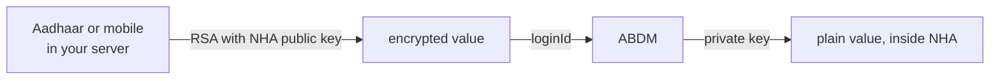

# HIE-CM M1 build

Scaffolds an ABDM M1 integration one flow at a time. M1 covers ABHA creation, login and profile management.

## How this skill runs

Every flow below is an OODA loop, not a recipe: observe the actual state (last response, last error), orient against the flow step matched below, decide the cheapest next action, act, and return to observe. A flow step is done only when its exit condition is observed against the sandbox, never because it "should have worked."

Loop limit: 8 passes per flow step. Hitting the limit is an escalation: state what was observed, what was tried, and which atom to read, then ask one question.

## Rules to hold before you call anything

#### Why identifiers are encrypted, and where to do it (`hiecm.concept.encrypted-identifiers`)

Across M1, the value you put in `loginId` is not the raw Aadhaar,
ABHA or mobile number. It is that value encrypted against NHA's public
key.

The same applies to OTP values on several calls.

What you encrypt has a shape, and the service checks it after it
decrypts. An ABHA number is `NN-NNNN-NNNN-NNNN`, dashes included, for
example `91-1234-5678-9015`. An Aadhaar number is 12 digits with no
spaces. A mobile number is 10 digits with no country code. Encrypting an
ABHA number as 14 bare digits is rejected: a login OTP request sent that
way on the sandbox on 2026-09-11 returned
`400 {"loginId": "LoginId is invalid"}`, and the same number with its
dashes passed validation and went on to look the account up.

The model is straightforward: NHA publishes a public key, you encrypt
locally, only NHA can decrypt.



NHA's collection also contains a hosted helper that encrypts a value for
you, and two third party encryption websites. Those are conveniences for
trying a flow by hand.

#### The padding comes with the key

The certificate response carries the algorithm next to the key:

```response
{
  "publicKey": "<base64 DER>",
  "encryptionAlgorithm": "RSA/ECB/OAEPWithSHA-1AndMGF1Padding"
}
```

Read `encryptionAlgorithm` and encrypt with what it names. It is a Java
transformation string, so translate it for your language rather than
assuming: `RSA/ECB/OAEPWithSHA-1AndMGF1Padding` means RSA-OAEP with
SHA-1 for both the digest and the mask generation function, which in
Node is
`crypto.publicEncrypt({ key, padding: crypto.constants.RSA_PKCS1_OAEP_PADDING, oaepHash: 'sha1' }, ...)`.
Send the result base64 encoded.

Hard coding the padding works until the field changes, and then fails
in a way that looks like a bad value rather than a stale constant. Code
that reads the field survives a rotation. Code that cannot recognise
what the field names should refuse to encrypt rather than fall back to
a default.

PKCS#1 v1.5 is refused today, and so is OAEP with SHA-256. Neither
refusal names encryption. The call for each language, and the padding
the older API families take, is in
encrypting sensitive inputs.

#### Encrypting sensitive inputs, Aadhaar, mobile, OTP and passwords (`hiecm.concept.input-encryption`)

Five kinds of values never travel raw in an M1 request body: Aadhaar
numbers, mobile numbers, email addresses, OTP values and passwords. Each
one is RSA encrypted with NHA's public certificate first, then base64 of
the ciphertext goes in the field. That is why the API pages write
placeholders like `<RSA_ENCRYPTED_AADHAAR_NUMBER>`: the field name says
what goes in, the placeholder says it must already be encrypted.

The model is public key encryption: NHA publishes the public half, you
encrypt with it, only NHA's private half can decrypt. Your system never
needs a secret to do this, only the current certificate.

Two ways to produce an encrypted value:

1. **Locally, against NHA's published public key. This is the
   production path.** NHA's M1 document names a `public/certificate`
   API for fetching the public key, listed again under developer
   utilities. In the document as we received it, the curl example and
   the response are screenshots that did not convert to text, so the
   full URL, the headers and the response shape are not recorded here,
   and the Postman collection does not contain the call. The
   verification task below closes this gap.
2. **NHA's encrypt helper, for trying a flow by hand only.** The
   endpoint atom hiecm.endpoint.m1-encrypt-value documents it and why
   it must never be a production path: sending an Aadhaar or mobile
   number to a remote endpoint so it can be encrypted defeats the point
   of encrypting it.

For checking your local encryption by hand, NHA's document points at
the RSA tool at devbeaver.com. Do not paste live personal data into a
third party tool; use test values.

#### The padding depends on which API family you are calling

This is the part that costs people days, and it is not stated in NHA's
prose documents. There is no single ABDM padding scheme. The scheme
that works is a property of the API family, and the same integrator
often needs both:

| Calling | Padding | Key |
|---|---|---|
| V3 ABHA and PHR registration and login, the flows this catalogue documents | RSA OAEP with SHA-1 | the certificate from `/v3/profile/public/certificate`, 4096 bit |
| Older healthid API family, V1 and V2 | RSA PKCS1 v1.5 | a separate healthid public key, 4096 bit |
| NHPR, the M4 professional registry | RSA PKCS1 v1.5 | a separate NHPR public key, 2048 bit |

**For everything in this catalogue's M1 scope, use OAEP with SHA-1.**
Note the hash: OAEP defaults to SHA-256 in most libraries, and SHA-256
here is rejected. The digest must be SHA-1 for both the OAEP hash and
the MGF1 mask generation, which is the library default when SHA-1 is
passed as the hash. Output is the raw ciphertext, standard base64
encoded, into the field.

```
Go      rsa.EncryptOAEP(sha1.New(), rand.Reader, pub, []byte(value), nil)
Python  public_key.encrypt(value, padding.OAEP(
            mgf=padding.MGF1(hashes.SHA1()), algorithm=hashes.SHA1(), label=None))
Java    Cipher.getInstance("RSA/ECB/OAEPWithSHA-1AndMGF1Padding")
Node    crypto.publicEncrypt({key, padding: RSA_PKCS1_OAEP_PADDING,
            oaepHash: "sha1"}, buf)
```

Each key is an RSA public key in X.509 SubjectPublicKeyInfo form. The
V3 certificate endpoint returns it as bare base64 DER, with no
`-----BEGIN PUBLIC KEY-----` armour, so add the armour before your
library will load it. Working integrations pin the key rather than
fetching it per request, and refresh it on rotation.

The evidence: a production V3 integration running against ABDM uses
OAEP with SHA-1 for the V3 registration and login flows, and PKCS1 v1.5
for the healthid and NHPR families, with a distinct key per family.
NHA's own published code corroborates the PKCS1 v1.5 half: the UHI
backend states `Cipher.getInstance("RSA/ECB/PKCS1Padding")` outright,
and NHA's ABHA application encrypts through a library whose RSA default
is PKCS1 v1.5. No NHA published source in reach states the V3 OAEP
parameters, which is exactly why integrators reading only the documents
get this wrong.

The V3 certificate call is settled:
`GET /v3/profile/public/certificate` returns
`{"publicKey": "<base64 DER>"}`, documented in
get RSA public certificate.
The rotation policy for each key is not published. Cache the
certificate with a validity window rather than forever.

```observation schema=precondition
requires: the public key for the API family you are calling
settled:
  - v3 padding: RSA OAEP, SHA-1 for both digest and MGF1
  - healthid and nhpr padding: RSA PKCS1 v1.5
  - key format: X.509 SubjectPublicKeyInfo, one key per API family. The
    V3 endpoint returns it as base64 DER with no PEM armour
  - ciphertext encoding: standard base64
unknowns:
  - rotation policy per key
closed_by: sandbox verification run, recorded in this atom
```

#### A suggested ABHA journey, and what holds if you design your own (`hiecm.concept.m1-journey-design`)

Start from why a front desk adopts ABHA at all, because it decides the shape
of everything else.

It is not the identifier. It is that the receptionist stops typing. A verified
ABHA profile carries the whole registration form already: given, middle and
family name, day, month and year of birth, gender, mobile, email, the full
address with its state, district, subdistrict, village and ward names and their
LGD codes, the pincode, and a photograph. A desk that reads that profile enters
nothing and corrects little.

So the ABHA step comes **before** your registration form, and fills it. A
journey that registers the patient first and offers ABHA afterwards has already
spent the keystrokes it existed to save, and leaves ABHA looking like an
identifier to file rather than the reason the queue moved faster. If you build
one thing from this page, build that order.

ABDM publishes operations, not a user experience. How your registration
screen looks and what it asks first is yours to decide, and a product that
knows its own counter will often beat the default below.

M1 gives you around forty operations, and the gap between that and one
screen at a desk is where most of the design work is. So this page carries
two different kinds of thing, and they are not weighted the same:

- **A suggested journey.** One worked default that gets a person through the
  desk. Take it as a starting point, change what does not fit, or ignore it.
- **What holds regardless.** A short list of platform facts that constrain
  any design. These are not suggestions, and a journey that ignores them
  fails whoever built it.

Read the second list even if you skip the first.

Three ways to put ABHA in a product, in increasing order of control and of
work:

| Shape | You write | Use it when |
|---|---|---|
| Redirect or QR to a hosted page | No frontend code | A counter, a kiosk, a poster, or a pilot |
| An embedded component in your own page | A mount point and callbacks | The journey sits inside your own registration screen |
| The operations directly | Every screen | A native app, or a journey nobody else's UI fits |

ABDM publishes the operations. The first two shapes are things you or a
vendor build on top of them, so choosing one is a build or buy decision rather
than a question about ABDM. If nobody has built the hosted page for your
deployment, that row is not available to you whatever the table says.

The choice is per journey, not per integration. Driving login from the
operations while sending creation to a hosted page is a reasonable split, and
a common one: login is a handful of calls, and creation carries the identity
methods and the most screens.

#### The flow, in full

Everything after this section is detail on one of these five steps. If you read
nothing else, read this.

1. **Start registering the patient.** Your own record, your own number. This
   completes whatever happens next.
2. **Ask whether they have an ABHA.** One question, yes or no. No means the
   form is typed by hand and the patient is treated exactly the same.
3. **Take one identifier.** Aadhaar or mobile, and where the desk knows, an
   ABHA number or address. Aadhaar is the one to recommend: it is the only
   route ending in a KYC verified ABHA number.
   **Then, under Aadhaar only, how they prove it is theirs:** an OTP to the
   linked phone, a face scan, or a fingerprint or iris reader. A mobile takes
   the OTP sent to it and offers no second question.
4. **Log in or create, decided by the answer and not by the person.** Every
   identifier starts on the login path, Aadhaar included. The response says
   whether an account exists: one or several means log in, none means offer to
   create. Never ask the person at the desk which of these they want.

   Two things here are load bearing and are covered below: an identifier wired
   straight to the enrolment path creates a second ABHA for anybody who already
   has one, and the token a login verification returns is not yet the token a
   profile call accepts.
5. **Fill your form from what came back.** The accounts array on the
   verification already carries the name, gender, date of birth and photograph,
   so the form can fill the moment the OTP verifies. The profile call adds the
   address and its codes. Either way the receptionist reads the form back and
   corrects it rather than typing it.

Step 5 is the reason the other four are worth doing. Step 4 is where a
duplicate ABHA is created if the branch is wrong.

#### Holds regardless: the profile is the point, so fetch it before you type

Two ways the profile reaches your desk, and the first one asks nothing of your
receptionist at all.

**The patient scans your counter.** You display a QR carrying your facility id
and a counter id. The patient scans it with their own PHR application, consents
there, and ABDM posts their profile to your registered callback. Nobody at your
desk types, asks or verifies anything: the record simply arrives, already
consented. See receive a shared patient profile.
This needs a registered facility and a reachable callback, which is the price of
the cheapest desk experience available.

**Your desk asks for an identifier.** Where the patient has no PHR application,
or the queue will not wait for one, run the identifier journey below. It ends in
a token, and that token reads
the profile.

Either way the registration form is the **destination**: it opens already
filled, and the receptionist confirms rather than enters. Manual entry is the
fallback for a person with no ABHA, not the default path with ABHA bolted on
afterwards.

One caution worth designing for. The profile is what ABDM holds, not what your
clinician sees in front of them. Names get transliterated, an address may be
years old, and a shared mobile may belong to a relative. Present the filled form
for confirmation rather than saving it unseen, and keep your own record editable
afterwards.

#### Suggested: one screen that does not ask login or create

Asking "do you want to log in or create an ABHA?" puts a question to the person
that they often cannot answer. The shape that avoids it is one screen titled
for both outcomes, which takes an identifier and lets the response decide.

Worked shape for that first screen, in the order the person meets it:

1. **A step indicator showing the whole journey.** Four dots, the first one
   filled. A person who can see the end of a queue waits differently from one
   who cannot, and this is the cheapest thing on the screen.
2. **A title that covers both outcomes.** "Login or Create your ABHA" commits
   to neither and needs no decision from the person.
3. **Two identifier choices, one marked as recommended.** Aadhaar earns the
   recommendation because it is the only route that ends in a KYC verified ABHA
   number. Mobile sits beside it for the person who does not have their Aadhaar
   to hand. Two is a glance; five is a decision.
4. **The input shaped like the thing.** An Aadhaar number in three groups of
   four is easier to read back off a card than twelve unbroken digits. A mobile
   number gets a country prefix shown rather than typed.
5. **The rest behind a disclosure.** "Other login options" collapsed, holding
   ABHA number and ABHA address. They are there for the person who has one, and
   invisible to everyone else.
6. **Consent inline, not as a step.** One line above the button naming what
   proceeding agrees to.
7. **The button disabled until the input is valid.** The first OTP a person
   wastes is the one sent to a half typed number.

That is one question on screen one, and the ladder of identifier types is
three deep rather than flat: recommended, alternative, and disclosed.

A chooser up front is the better shape where the desk genuinely knows, for
example a counter that only ever registers new patients, or a kiosk placed
next to a sign that says what it is for.

#### Holds regardless: Aadhaar is a login identifier too

An Aadhaar number identifies a person who may already hold an ABHA. Wiring it
to the enrolment path because enrolment is where Aadhaar is most discussed
sends every one of those people to create a second number, and `abha-enrol` in
the scope array is the signature of that mistake.

Send every identifier to the login path first and let the answer decide. The
scope pairs differ between the two paths, so getting this wrong surfaces as
`ABDM-1107`, invalid combinations of scopes, rather than as anything that
mentions duplicates. See ABDM-1107.

#### Holds regardless: the login token is not the profile token

A login verification returns a token, and it is a transfer token rather than a
session token. Its JWT says `"typ": "Transfer"` and it lives five minutes.
Exchange it at the account selection call for the session token, and do that
whatever the length of the accounts array, including one.

A profile call sent the transfer token refuses it as `ABDM-1094`, "X-token
expired", or as "Invalid X-token" depending on the header shape. Neither says
the wrong kind of token was sent, and both were observed on a token one second
old. See verify a login OTP.

#### Holds regardless: look before you create, by whatever means

Creation with an account already in existence leaves the person holding two
ABHA numbers, and no operation in M1 merges them afterwards. The patient
carries the duplicate.

The rule is that you look first. It is not a rule about how you look, and the
mobile OTP journey suggested above is only one of the ways:

- Verify an OTP and read the accounts the response carries.
- Search for the person before you begin.
- Ask, where the desk can reasonably ask, and trust the answer enough to check
  it.

Any of these satisfies the rule. Whatever your journey looks like, creation is
the branch taken when the look came back empty.

The verification response is what most journeys branch on, and it carries
everything the branch needs:

```response
{
  "txnId": "<TXN_ID>",
  "authResult": "success",
  "token": "<TOKEN>",
  "expiresIn": 1800,
  "refreshToken": "<REFRESHTOKEN>",
  "accounts": [
    {"ABHANumber": "<ABHA_NUMBER>", "preferredAbhaAddress": "<ABHA_ADDRESS>",
     "name": "<NAME>", "status": "<STATUS>", "mobileVerified": true}
  ]
}
```

Read `accounts` before anything else:

| What you get | What it means | Where the person goes |
|---|---|---|
| One account | They have an ABHA and it is unambiguous | Signed in. Store the number and the address |
| More than one | One mobile carries several ABHA accounts | A chooser, then select the account with the chosen `ABHANumber` and the same `txnId`, which returns the final token |
| None | Nobody holds an ABHA on that identifier | The create branch, if you offer one |

More than one account is common enough to design for rather than treat as an
edge case: a shared family handset is the ordinary cause.

One caution about the empty answer, which decides how much you can lean on it.
A lookup that finds no account and a lookup whose encrypted identifier the
service could not read can present the same way. So an empty result means
"nothing found for what the service received", which is only "this person has
no ABHA" once you know the service received what you sent. Prove the
encryption path first, once, and the empty answer becomes trustworthy. See
why identifiers are encrypted.

#### Holds regardless: an ABHA is optional to your record

A person may decline, may not have their Aadhaar-linked mobile to hand, or may
be in a queue. ABDM does not require that they hold an ABHA to be treated, and
your patient record is keyed by your own number rather than by one.

So a journey that cannot complete without an ABHA blocks care, which is a
product decision worth making deliberately rather than by omission. The
suggested shape is to return the identifier you already had, mark the record
as having none, and offer the journey again from the chart. See
ABHA number and address for what you store when
it does complete.

#### Identifiers and auth methods are two different questions

Listing "Aadhaar OTP" and "face authentication" side by side as though they
were alternatives is the mistake that makes this look like five choices. They
are two questions, and the second only appears under one answer to the first.

**Which identifier does the person have?** ABDM accepts four:

| Identifier | Ends in |
|---|---|
| Aadhaar | A KYC verified ABHA number, which is why it is the one to recommend |
| Mobile | An ABHA address, upgradeable to KYC later |
| ABHA number | Sign in to an account they already hold |
| ABHA address | Sign in to an account they already hold |

**How do they prove it is theirs?** That is `authMethods`, and ABDM's own values
are `otp`, `bio`, `face`, `iris`, `child` and `demo_auth`. Aadhaar accepts the
range; a mobile accepts the OTP sent to it and nothing else.

| Auth method | Reach for it when |
|---|---|
| OTP | The default. The Aadhaar linked phone is with them |
| Face | That phone is not with them, and a camera is |
| Fingerprint or iris | A reader is at the desk |
| Demographic | Nothing else is available. It is exact: a near miss on name, date of birth or gender is a refusal rather than a warning |

A child ABHA is created under a parent who is already signed in, so it is a
different journey rather than another method on this screen.

So the screen asks for an identifier, and offers the auth methods underneath it
only where there is more than one to offer. Most integrations ship Aadhaar with
OTP and mobile with OTP, and add the rest when a desk asks for them.

#### The journeys that are not creation

An M1 surface is more than a registration form. These are the other placements
the operations support, listed so that a design of your own can account for
them rather than discovering them later:

- **Find an existing ABHA**, when the person has one and cannot remember it.
  See find an ABHA.
- **Upgrade an address to KYC verified**, for an account made by mobile OTP.
- **Show the card and the QR code**, which is what a patient is asked for at a
  counter.
- **Share a profile at the counter**, by displaying a QR the patient scans with
  their own app, so your desk types nothing.
- **Update the profile**, including the mobile number, which changes often and
  is the most common reason a person returns to this surface.

#### OTP screens

One platform fact and several suggestions, and it is worth knowing which is
which.

**Holds regardless:** attempts are counted against the transaction, not
against the person, and a transaction has a limited number of them. The code is
never persisted and never logged.

That gives a resend button two different jobs either side of one boundary, and
getting them the wrong way round is how a receptionist reaches a dead
transaction:

| The person presses resend | What to do |
|---|---|
| The transaction still has attempts | Reuse the same transaction id. Starting a new one throws away a live transaction for no reason |
| The transaction is locked | The transaction is spent. Start a fresh one. Retrying this one cannot recover it |

The number of attempts a transaction allows is not published, and the refusal
names the attempt count rather than the wait remaining, so a client cannot
compute how long to disable the button. Read the refusal and start again rather
than counting attempts yourself.

**Suggested:** show which number the code went to, masked to the last four
digits, because a person with two phones needs to know. Put a visible wait on
the resend button rather than leaving it live, since the fastest route to a
locked transaction is a person pressing it four times.

#### Suggested: let the response drive the next screen

A journey hard coded as a fixed sequence has to be edited every time ABDM adds
a branch. A journey that renders whichever screen the last response implies
does not.

The states worth having a screen for are the ones the responses can put you in:
an identifier is needed, an OTP is needed, an OTP needs confirming, an account
needs choosing, something needs creating, and the journey is finished. Name
them in your own code, map each response to one of them, and let the screen
follow the state rather than the call site.

The practical gain is the account chooser. A journey written as a straight line
from OTP to signed in has nowhere to put the second account, and the shared
family handset is where it is discovered.

#### Suggested: branding as configuration

Colours, a logo and a language read from whatever the deployment already uses,
rather than compiled in. A journey that needs a rebuild to change a colour
gets forked by the first customer who asks. This is ordinary product practice
rather than anything ABDM requires.

## Prove these before you build a flow

### Prove your encryption padding before you build anything else (`hiecm.test.m1-encryption-padding`)

Encrypt the 10 digit mobile number, no country code, with RSA-OAEP and
SHA-1 for both the digest and the mask generation function. Base64 the
ciphertext. Send it as `loginId`:

```bash
curl -X POST 'https://abhasbx.abdm.gov.in/abha/api/v3/profile/login/request/otp' \
  -H 'Authorization: Bearer <ACCESS_TOKEN_FROM_SESSIONS_CALL>' \
  -H 'REQUEST-ID: <FRESH_UUID>' \
  -H 'TIMESTAMP: <UTC_ISO_8601_WITH_MILLISECONDS_AND_Z>' \
  -H 'Content-Type: application/json' \
  -d '{
  "scope": ["abha-login", "mobile-verify"],
  "loginHint": "mobile",
  "loginId": "<MOBILE_ENCRYPTED_OAEP_SHA1_BASE64>",
  "otpSystem": "abdm"
}'
```

In Node the encryption is:

```js
crypto.publicEncrypt(
  { key: pem, padding: crypto.constants.RSA_PKCS1_OAEP_PADDING, oaepHash: 'sha1' },
  Buffer.from(mobile, 'utf8'),
).toString('base64')
```

where `pem` is the `publicKey` from the certificate call wrapped in
`-----BEGIN PUBLIC KEY-----` armour at 64 characters per line.

Run this call against `/v3/profile/login/request/otp` and nowhere else.
`/v3/enrollment/request/otp` refuses every input with the same body, so
a padding matrix run against it excludes the correct answer.

The login endpoint only tells them apart when the plaintext is a
registered number. Sending a correctly encrypted `9999999999` there
returns `400 {"loginId": "Invalid Mobile Number"}`, exactly what a
wrong padding returns. The 200 is the signal, and only a real number
can produce it.

**Exit condition (Observe until this is true)**

You receive 200 and a body carrying `txnId` and a message naming the
last four digits of the mobile:

```response
{"txnId": "<TXN_ID>", "message": "OTP sent to mobile number ending with ******<LAST4>"}
```

An OTP arrives on that phone. The padding is right and the certificate
is right. Build the rest of M1 on that code path.

## Flows

### Create an ABHA using an Aadhaar OTP (`hiecm.flow.m1-create-abha-aadhaar-otp`)

**Before you start**

- A client id and secret, and a working session token. See
  registration and credentials (shared.sandbox.registration-and-credentials).
- The person's Aadhaar number, encrypted with RSA-OAEP with SHA-1, base64 encoded, under the 4096-bit certificate from `/v3/profile/public/certificate`. PKCS#1 v1.5 and OAEP with SHA-256 are both refused, and neither refusal names encryption. See
  why identifiers are encrypted (hiecm.concept.encrypted-identifiers).
- The person present, because they must read an OTP from their phone.
- Their explicit consent to create an ABHA, which you send in the
  enrolment call.

**Act: the calls in this flow, in order**

#### Send an OTP to begin or continue an enrolment (`hiecm.endpoint.m1-enrolment-request-otp`)

```bash
curl -X POST 'https://abhasbx.abdm.gov.in/abha/api/v3/enrollment/request/otp' \
  -H 'Authorization: Bearer <ACCESS_TOKEN>' \
  -H 'REQUEST-ID: <FRESH_UUID>' \
  -H 'TIMESTAMP: <ISO_8601_TIMESTAMP>' \
  -H 'Content-Type: application/json' \
  -d '{
  "scope": [
    "abha-enrol"
  ],
  "loginHint": "aadhaar",
  "loginId": "_encrypted_12_digit_aadhaar_no_",
  "otpSystem": "aadhaar"
}'
```

#### Create an ABHA from a verified Aadhaar OTP (`hiecm.endpoint.m1-enrolment-by-aadhaar`)

```bash
curl -X POST 'https://abhasbx.abdm.gov.in/abha/api/v3/enrollment/enrol/byAadhaar' \
  -H 'Authorization: Bearer <ACCESS_TOKEN>' \
  -H 'REQUEST-ID: <FRESH_UUID>' \
  -H 'TIMESTAMP: <ISO_8601_TIMESTAMP>' \
  -H 'BENEFIT_NAME: <BENEFIT_SCHEME_NAME>' \
  -H 'X-token: <X_TOKEN_FROM_LOGIN_VERIFY>' \
  -H 'Content-Type: application/json' \
  -d '{
  "authData": {
    "authMethods": [
      "otp"
    ],
    "otp": {
      "txnId": "<TXN_ID>",
      "otpValue": "<OTPVALUE>",
      "mobile": "<MOBILE>"
    }
  },
  "consent": {
    "code": "abha-enrollment",
    "version": "1.4"
  }
}'
```

#### Verify an OTP that ABDM sent, during enrolment (`hiecm.endpoint.m1-enrolment-verify-abdm-otp`)

```bash
curl -X POST 'https://abhasbx.abdm.gov.in/abha/api/v3/enrollment/auth/byAbdm' \
  -H 'Authorization: Bearer <ACCESS_TOKEN>' \
  -H 'REQUEST-ID: <FRESH_UUID>' \
  -H 'TIMESTAMP: <ISO_8601_TIMESTAMP>' \
  -H 'Content-Type: application/json' \
  -d '{
  "scope": [
    "abha-enrol",
    "mobile-verify"
  ],
  "authData": {
    "authMethods": [
      "otp"
    ],
    "otp": {
      "txnId": "<TXN_ID>",
      "otpValue": "<OTPVALUE>"
    }
  }
}'
```

#### Get suggested ABHA addresses for a new account (`hiecm.endpoint.m1-enrolment-address-suggestions`)

```bash
curl -X GET 'https://abhasbx.abdm.gov.in/abha/api/v3/enrollment/enrol/suggestion' \
  -H 'Authorization: Bearer <ACCESS_TOKEN>' \
  -H 'REQUEST-ID: <FRESH_UUID>' \
  -H 'TIMESTAMP: <ISO_8601_TIMESTAMP>' \
  -H 'TRANSACTION_ID: <TXN_ID_FROM_ENROLMENT>'
```

#### Claim a chosen ABHA address (`hiecm.endpoint.m1-enrolment-claim-abha-address`)

```bash
curl -X POST 'https://abhasbx.abdm.gov.in/abha/api/v3/enrollment/enrol/abha-address' \
  -H 'Authorization: Bearer <ACCESS_TOKEN>' \
  -H 'REQUEST-ID: <FRESH_UUID>' \
  -H 'TIMESTAMP: <ISO_8601_TIMESTAMP>' \
  -H 'Content-Type: application/json' \
  -d '{
  "txnId": "<TXN_ID>",
  "abhaAddress": "<ABHA_ADDRESS>",
  "preferred": 1
}'
```

**Exit condition (Observe until this is true)**

The person has an ABHA number, and an address they chose rather than the
digits-based default.

Confirm it by reading the profile back and checking that the address you
claimed is present and marked preferred. Do not treat the enrolment
response alone as the end of the flow: an account with only the default
address is a half finished job the person will not recognise later.

**If it goes wrong**

The OTP never arrives. The mobile registered against Aadhaar is not
necessarily the one the person is holding, and only the Aadhaar mobile
receives this OTP.

The enrolment call fails after the OTP was accepted. Do not retry it
blindly, because a retry that succeeds may enrol the person twice. Start
a fresh transaction instead.

The chosen address is refused. NHA's policy requires at least four
characters, no leading digit, and no leading or trailing dot. Validate
before submitting so the person is not guessing.

Every call fails with a header error. Check
ABDM-2402 (hiecm.error.abdm-2402) and
ABDM-2404 (hiecm.error.abdm-2404) before assuming the flow is wrong.

### Create an ABHA from an identity document (`hiecm.flow.m1-create-abha-by-document`)

**Before you start**

- A working session token.
- The person's mobile number, and the person present to read an OTP.
- The document details.

**Act: the calls in this flow, in order**

#### Send an OTP to begin or continue an enrolment (`hiecm.endpoint.m1-enrolment-request-otp`)

```bash
curl -X POST 'https://abhasbx.abdm.gov.in/abha/api/v3/enrollment/request/otp' \
  -H 'Authorization: Bearer <ACCESS_TOKEN>' \
  -H 'REQUEST-ID: <FRESH_UUID>' \
  -H 'TIMESTAMP: <ISO_8601_TIMESTAMP>' \
  -H 'Content-Type: application/json' \
  -d '{
  "scope": [
    "abha-enrol"
  ],
  "loginHint": "aadhaar",
  "loginId": "_encrypted_12_digit_aadhaar_no_",
  "otpSystem": "aadhaar"
}'
```

#### Verify an OTP that ABDM sent, during enrolment (`hiecm.endpoint.m1-enrolment-verify-abdm-otp`)

```bash
curl -X POST 'https://abhasbx.abdm.gov.in/abha/api/v3/enrollment/auth/byAbdm' \
  -H 'Authorization: Bearer <ACCESS_TOKEN>' \
  -H 'REQUEST-ID: <FRESH_UUID>' \
  -H 'TIMESTAMP: <ISO_8601_TIMESTAMP>' \
  -H 'Content-Type: application/json' \
  -d '{
  "scope": [
    "abha-enrol",
    "mobile-verify"
  ],
  "authData": {
    "authMethods": [
      "otp"
    ],
    "otp": {
      "txnId": "<TXN_ID>",
      "otpValue": "<OTPVALUE>"
    }
  }
}'
```

#### Create an ABHA from an identity document (`hiecm.endpoint.m1-enrolment-by-document`)

```bash
curl -X POST 'https://abhasbx.abdm.gov.in/abha/api/v3/enrollment/enrol/byDocument' \
  -H 'Authorization: Bearer <ACCESS_TOKEN>' \
  -H 'REQUEST-ID: <FRESH_UUID>' \
  -H 'TIMESTAMP: <ISO_8601_TIMESTAMP>' \
  -H 'Content-Type: application/json' \
  -d '{
  "txnId": "<TXN_ID>",
  "documentType": "DRIVING_LICENCE",
  "documentId": "DL0820****858",
  "firstName": "<FIRST_NAME>",
  "middleName": "<MIDDLE_NAME>",
  "lastName": "<LAST_NAME>",
  "dob": "<DATE_OF_BIRTH>",
  "gender": "M",
  "frontSidePhoto": "<ENCRYPTED_VALUE>",
  "backSidePhoto": "<ENCRYPTED_VALUE>",
  "address": "<ADDRESS>",
  "state": "<STATE>",
  "district": "<DISTRICT>",
  "pinCode": "<PIN_CODE>",
  "consent": {
    "code": "abha-enrollment",
    "version": "1.4"
  }
}'
```

#### Read the signed in person's ABHA profile (`hiecm.endpoint.m1-profile-get-account`)

```bash
curl -X GET 'https://abhasbx.abdm.gov.in/abha/api/v3/profile/account' \
  -H 'Authorization: Bearer <ACCESS_TOKEN>' \
  -H 'REQUEST-ID: <FRESH_UUID>' \
  -H 'TIMESTAMP: <ISO_8601_TIMESTAMP>' \
  -H 'X-token: <X_TOKEN_FROM_LOGIN_VERIFY>'
```

#### Get the ABHA QR code (`hiecm.endpoint.m1-profile-get-qr-code`)

```bash
curl -X GET 'https://abhasbx.abdm.gov.in/abha/api/v3/profile/account/qrCode' \
  -H 'Authorization: Bearer <ACCESS_TOKEN>' \
  -H 'REQUEST-ID: <FRESH_UUID>' \
  -H 'TIMESTAMP: <ISO_8601_TIMESTAMP>' \
  -H 'X-token: <X_TOKEN_FROM_LOGIN_VERIFY>'
```

**Exit condition (Observe until this is true)**

The profile read returns an account, and the QR code call returns an
image.

Because the account is restricted, also confirm what it cannot yet do
before telling the person they are finished.

**If it goes wrong**

The person expects full functionality. A document based account is
restricted, and the limits appear later as unexplained refusals unless
you say so at creation.

The document is not accepted. NHA's collection only exercises a driving
licence, so treat other document types as unproven until you have run
them.

### Create an ABHA using Aadhaar demographic authentication (`hiecm.flow.m1-create-abha-demographic-auth`)

**Before you start**

- A working gateway session token. See
  the gateway session (hiecm.concept.gateway-session).
- The public certificate, because the Aadhaar number is encrypted before
  it is sent. See fetch the public certificate (hiecm.endpoint.m1-get-public-certificate).
  It arrives as base64 DER and needs PEM armour before your library will
  load it.
- The padding, which is RSA-OAEP with SHA-1, base64 encoded, under the 4096-bit certificate from `/v3/profile/public/certificate`. PKCS#1 v1.5 and OAEP with SHA-256 are both refused, and neither refusal names encryption. See
  why identifiers are encrypted (hiecm.concept.encrypted-identifiers).
- The person's name exactly as Aadhaar holds it, their date of birth and
  their gender. A near miss on any of them is a refusal, not a warning.
- Their consent, recorded the same way the other enrolment routes record it.

**Act: the calls in this flow, in order**

#### Create an ABHA from a verified Aadhaar OTP (`hiecm.endpoint.m1-enrolment-by-aadhaar`)

```bash
curl -X POST 'https://abhasbx.abdm.gov.in/abha/api/v3/enrollment/enrol/byAadhaar' \
  -H 'Authorization: Bearer <ACCESS_TOKEN>' \
  -H 'REQUEST-ID: <FRESH_UUID>' \
  -H 'TIMESTAMP: <ISO_8601_TIMESTAMP>' \
  -H 'BENEFIT_NAME: <BENEFIT_SCHEME_NAME>' \
  -H 'X-token: <X_TOKEN_FROM_LOGIN_VERIFY>' \
  -H 'Content-Type: application/json' \
  -d '{
  "authData": {
    "authMethods": [
      "otp"
    ],
    "otp": {
      "txnId": "<TXN_ID>",
      "otpValue": "<OTPVALUE>",
      "mobile": "<MOBILE>"
    }
  },
  "consent": {
    "code": "abha-enrollment",
    "version": "1.4"
  }
}'
```

#### Encrypt a value with NHA's public key (`hiecm.endpoint.m1-encrypt-value`)

```bash
curl -X POST 'https://abhasbx.abdm.gov.in/abha/api/v3/phr/app/enrollment/encrypt' \
  -H 'Authorization: Bearer <ACCESS_TOKEN>' \
  -H 'REQUEST-ID: <FRESH_UUID>' \
  -H 'TIMESTAMP: <UTC_ISO_8601_WITH_MILLISECONDS_AND_Z>' \
  -H 'Content-Type: application/json' \
  -d '{
  "data": "<PLAINTEXT_TO_ENCRYPT>"
}'
```

#### Get RSA Public Certificate (`hiecm.endpoint.m1-get-public-certificate`)

```bash
curl -X GET 'https://abhasbx.abdm.gov.in/abha/api/v3/profile/public/certificate' \
  -H 'Authorization: Bearer <ACCESS_TOKEN>' \
  -H 'REQUEST-ID: <FRESH_UUID>' \
  -H 'TIMESTAMP: <ISO_8601_TIMESTAMP>' \
  -H 'X-CM-ID: sbx'
```

#### Read the signed in person's ABHA profile (`hiecm.endpoint.m1-profile-get-account`)

```bash
curl -X GET 'https://abhasbx.abdm.gov.in/abha/api/v3/profile/account' \
  -H 'Authorization: Bearer <ACCESS_TOKEN>' \
  -H 'REQUEST-ID: <FRESH_UUID>' \
  -H 'TIMESTAMP: <ISO_8601_TIMESTAMP>' \
  -H 'X-token: <X_TOKEN_FROM_LOGIN_VERIFY>'
```

**Exit condition (Observe until this is true)**

The enrolment response carries an ABHA number and a profile, and
reading the profile (hiecm.endpoint.m1-profile-get-account) with the
token from that response returns the same account rather than a 401.

The profile already carries an ABHA address, which is what tells you the
default was generated and that this was the demographic route rather than
one that still owes an address.

**If it goes wrong**

- The demographics do not match Aadhaar. The specification names
  `INVALID_DEMOGRAPHIC_DETAILS`. Which field failed is not published, so
  your screen has to ask the person to check all of them.
- The parsing reads no token, because the code looked under `tokens` and
  the value is at the top level.
- The person is surprised by an unreadable ABHA address, because the
  default was generated and nobody offered them a choice.

Nothing in this flow has been run against the sandbox from this
repository, so treat the step order as documented rather than proven.

### Create an ABHA using Aadhaar face authentication (`hiecm.flow.m1-create-abha-face-auth`)

**Before you start**

- Everything the OTP route needs. See
  create an ABHA using an Aadhaar OTP.
- The ABHA app installed on the person's phone, and the Aadhaar RD
  service available to it.
- A way to show a QR code, because that is how the transaction moves from
  your screen to their phone.

**Act: the calls in this flow, in order**

#### Start face or biometric authentication and get a transaction id (`hiecm.endpoint.m1-enrolment-face-auth-init`)

```bash
curl -X POST 'https://abhasbx.abdm.gov.in/abha/api/v3/enrollment/enrol/auth/init' \
  -H 'Authorization: Bearer <ACCESS_TOKEN>' \
  -H 'REQUEST-ID: <FRESH_UUID>' \
  -H 'TIMESTAMP: <ISO_8601_TIMESTAMP>'
```

#### Submit a captured biometric or face authentication block (`hiecm.endpoint.m1-enrolment-capture-pid`)

```bash
curl -X POST 'https://abhasbx.abdm.gov.in/abha/api/v3/enrollment/enrol/capturePID' \
  -H 'Authorization: Bearer <ACCESS_TOKEN>' \
  -H 'REQUEST-ID: <FRESH_UUID>' \
  -H 'TIMESTAMP: <ISO_8601_TIMESTAMP>' \
  -H 'Content-Type: application/json' \
  -d '{
  "scope": [
    "abha-enrol",
    "face-verify"
  ],
  "txnId": "<TXN_ID>"
}'
```

#### Create an ABHA from a verified Aadhaar OTP (`hiecm.endpoint.m1-enrolment-by-aadhaar`)

```bash
curl -X POST 'https://abhasbx.abdm.gov.in/abha/api/v3/enrollment/enrol/byAadhaar' \
  -H 'Authorization: Bearer <ACCESS_TOKEN>' \
  -H 'REQUEST-ID: <FRESH_UUID>' \
  -H 'TIMESTAMP: <ISO_8601_TIMESTAMP>' \
  -H 'BENEFIT_NAME: <BENEFIT_SCHEME_NAME>' \
  -H 'X-token: <X_TOKEN_FROM_LOGIN_VERIFY>' \
  -H 'Content-Type: application/json' \
  -d '{
  "authData": {
    "authMethods": [
      "otp"
    ],
    "otp": {
      "txnId": "<TXN_ID>",
      "otpValue": "<OTPVALUE>",
      "mobile": "<MOBILE>"
    }
  },
  "consent": {
    "code": "abha-enrollment",
    "version": "1.4"
  }
}'
```

#### Get suggested ABHA addresses for a new account (`hiecm.endpoint.m1-enrolment-address-suggestions`)

```bash
curl -X GET 'https://abhasbx.abdm.gov.in/abha/api/v3/enrollment/enrol/suggestion' \
  -H 'Authorization: Bearer <ACCESS_TOKEN>' \
  -H 'REQUEST-ID: <FRESH_UUID>' \
  -H 'TIMESTAMP: <ISO_8601_TIMESTAMP>' \
  -H 'TRANSACTION_ID: <TXN_ID_FROM_ENROLMENT>'
```

#### Claim a chosen ABHA address (`hiecm.endpoint.m1-enrolment-claim-abha-address`)

```bash
curl -X POST 'https://abhasbx.abdm.gov.in/abha/api/v3/enrollment/enrol/abha-address' \
  -H 'Authorization: Bearer <ACCESS_TOKEN>' \
  -H 'REQUEST-ID: <FRESH_UUID>' \
  -H 'TIMESTAMP: <ISO_8601_TIMESTAMP>' \
  -H 'Content-Type: application/json' \
  -d '{
  "txnId": "<TXN_ID>",
  "abhaAddress": "<ABHA_ADDRESS>",
  "preferred": 1
}'
```

**Exit condition (Observe until this is true)**

Same ending as the OTP route: the person has an ABHA number and an
address they chose, confirmed by reading the profile back.

The step specific to this route is the capture. You know it worked when
the capture call is accepted rather than when the app says the face
scan succeeded, because those are different events.

**If it goes wrong**

The person does not have the ABHA app. The flow cannot start, and the app
store redirect is part of the journey rather than an error.

The PID block is rejected as stale. Captures expire. Recapture rather
than retrying the same block.

The person completes face authentication and nothing happens in your
application. Nothing pushes that result to you, so you must continue the
flow yourself once they confirm.

### Create a child ABHA under a parent's account (`hiecm.flow.m1-create-child-abha`)

**Before you start**

- A working gateway session token. See
  the gateway session (hiecm.concept.gateway-session).
- The parent logged in, because the create call runs against the parent's
  authenticated session rather than the child's. See
  login by mobile number (hiecm.flow.m1-login-by-mobile).
- The parent's ABHA number or ABHA address, which identifies them on the
  create call.
- The parent aged 18 or over. Below that the enrolment is refused.
- The child's first name, last name, day, month and year of birth, and
  gender.

**Act: the calls in this flow, in order**

#### Create an ABHA from a verified Aadhaar OTP (`hiecm.endpoint.m1-enrolment-by-aadhaar`)

```bash
curl -X POST 'https://abhasbx.abdm.gov.in/abha/api/v3/enrollment/enrol/byAadhaar' \
  -H 'Authorization: Bearer <ACCESS_TOKEN>' \
  -H 'REQUEST-ID: <FRESH_UUID>' \
  -H 'TIMESTAMP: <ISO_8601_TIMESTAMP>' \
  -H 'BENEFIT_NAME: <BENEFIT_SCHEME_NAME>' \
  -H 'X-token: <X_TOKEN_FROM_LOGIN_VERIFY>' \
  -H 'Content-Type: application/json' \
  -d '{
  "authData": {
    "authMethods": [
      "otp"
    ],
    "otp": {
      "txnId": "<TXN_ID>",
      "otpValue": "<OTPVALUE>",
      "mobile": "<MOBILE>"
    }
  },
  "consent": {
    "code": "abha-enrollment",
    "version": "1.4"
  }
}'
```

#### List the child ABHA accounts linked to this account (`hiecm.endpoint.m1-enrolment-list-children`)

```bash
curl -X GET 'https://abhasbx.abdm.gov.in/abha/api/v3/enrollment/profile/children' \
  -H 'Authorization: Bearer <ACCESS_TOKEN>' \
  -H 'REQUEST-ID: <FRESH_UUID>' \
  -H 'TIMESTAMP: <ISO_8601_TIMESTAMP>' \
  -H 'X-token: <X_TOKEN_FROM_LOGIN_VERIFY>'
```

#### Update fields on an ABHA profile (`hiecm.endpoint.m1-profile-update-account`)

```bash
curl -X PATCH 'https://abhasbx.abdm.gov.in/abha/api/v3/profile/account' \
  -H 'Authorization: Bearer <ACCESS_TOKEN>' \
  -H 'REQUEST-ID: <FRESH_UUID>' \
  -H 'TIMESTAMP: <ISO_8601_TIMESTAMP>' \
  -H 'BENEFIT_NAME: <BENEFIT_SCHEME_NAME>' \
  -H 'X-token: <X_TOKEN_FROM_LOGIN_VERIFY>' \
  -H 'Content-Type: application/json' \
  -d '{
  "abhaNumber": "<ABHA_NUMBER>",
  "name": "<NAME>",
  "dob": "<DATE_OF_BIRTH>",
  "gender": "M"
}'
```

**Exit condition (Observe until this is true)**

The create response carries the child's ABHA number, and listing the
children on the parent's account returns that child with the count raised
by one. The listing is the proof, because the create response on its own
does not tell you the account was attached to the right parent.

**If it goes wrong**

- The parent is under 18. The specification names this refusal, and it is
  a rule about the parent rather than the child, which is not obvious from
  the screen the operator is looking at.
- The account has already enrolled as many children as it may. The
  specification names a child enrolment limit per ABHA, so an account that
  worked five times can refuse the sixth.
- The parent is not authenticated, or their token has expired. The create
  call runs against the parent's session, so this reads as an
  authorisation failure rather than as a validation one.

Nothing in this flow has been run against the sandbox from this
repository, so treat the step order as documented rather than proven.

### Find somebody's ABHA when they do not know it (`hiecm.flow.m1-find-abha`)

**Before you start**

- A working session token.
- The identifier the person remembers, encrypted with RSA-OAEP with SHA-1, base64 encoded, under the 4096-bit certificate from `/v3/profile/public/certificate`. PKCS#1 v1.5 and OAEP with SHA-256 are both refused, and neither refusal names encryption. See
  why identifiers are encrypted (hiecm.concept.encrypted-identifiers).
- The person present to read an OTP.

**Act: the calls in this flow, in order**

#### Encrypt a value with NHA's public key (`hiecm.endpoint.m1-encrypt-value`)

```bash
curl -X POST 'https://abhasbx.abdm.gov.in/abha/api/v3/phr/app/enrollment/encrypt' \
  -H 'Authorization: Bearer <ACCESS_TOKEN>' \
  -H 'REQUEST-ID: <FRESH_UUID>' \
  -H 'TIMESTAMP: <UTC_ISO_8601_WITH_MILLISECONDS_AND_Z>' \
  -H 'Content-Type: application/json' \
  -d '{
  "data": "<PLAINTEXT_TO_ENCRYPT>"
}'
```

#### Find an ABHA for somebody who does not know theirs (`hiecm.endpoint.m1-find-abha-search`)

```bash
curl -X POST 'https://abhasbx.abdm.gov.in/abha/api/v3/profile/account/abha/search' \
  -H 'Authorization: Bearer <ACCESS_TOKEN>' \
  -H 'REQUEST-ID: <FRESH_UUID>' \
  -H 'TIMESTAMP: <ISO_8601_TIMESTAMP>' \
  -H 'BENEFIT_NAME: <BENEFIT_SCHEME_NAME>' \
  -H 'Content-Type: application/json' \
  -d '{
  "scope": [
    "search-abha"
  ],
  "mobile": "<MOBILE>"
}'
```

#### Send a login OTP (`hiecm.endpoint.m1-login-request-otp`)

```bash
curl -X POST 'https://abhasbx.abdm.gov.in/abha/api/v3/profile/login/request/otp' \
  -H 'Authorization: Bearer <ACCESS_TOKEN>' \
  -H 'REQUEST-ID: <FRESH_UUID>' \
  -H 'TIMESTAMP: <ISO_8601_TIMESTAMP>' \
  -H 'BENEFIT_NAME: <BENEFIT_SCHEME_NAME>' \
  -H 'Content-Type: application/json' \
  -d '{
  "scope": [
    "abha-login",
    "mobile-verify"
  ],
  "loginHint": "mobile",
  "loginId": "<ENCRYPTED_MOBILE_NUMBER>",
  "otpSystem": "abdm"
}'
```

#### Verify a login OTP and get a user token (`hiecm.endpoint.m1-login-verify`)

```bash
curl -X POST 'https://abhasbx.abdm.gov.in/abha/api/v3/profile/login/verify' \
  -H 'Authorization: Bearer <ACCESS_TOKEN>' \
  -H 'REQUEST-ID: <FRESH_UUID>' \
  -H 'TIMESTAMP: <ISO_8601_TIMESTAMP>' \
  -H 'BENEFIT_NAME: <BENEFIT_SCHEME_NAME>' \
  -H 'T-token: <T_TOKEN_FROM_LOGIN_VERIFY>' \
  -H 'X-token: <X_TOKEN_FROM_LOGIN_VERIFY>' \
  -H 'Content-Type: application/json' \
  -d '{
  "scope": [
    "abha-login",
    "mobile-verify"
  ],
  "authData": {
    "authMethods": [
      "otp"
    ],
    "otp": {
      "txnId": "<TXN_ID>",
      "otpValue": "<OTPVALUE>"
    }
  }
}'
```

**Exit condition (Observe until this is true)**

You hold the person's ABHA account details and a token for it, and the
masked mobile shown during the search matched the phone they are holding.

If the person could not confirm the masked mobile, the flow has found
somebody else's account and must not continue.

**If it goes wrong**

The search finds nothing. The identifier may belong to no account, or to
an account in another environment. A sandbox account does not exist in
production.

The masked mobile is not theirs. Stop. This is the flow working
correctly, and continuing would disclose another person's account.

You are tempted to skip the OTP because search already returned the
account. Do not. Search plus verification is the flow; search alone is a
lookup of somebody else's identity.

### Log somebody in to their existing ABHA (`hiecm.flow.m1-login-by-mobile`)

**Before you start**

- A working session token.
- The person's mobile number, encrypted with RSA-OAEP with SHA-1, base64 encoded, under the 4096-bit certificate from `/v3/profile/public/certificate`. PKCS#1 v1.5 and OAEP with SHA-256 are both refused, and neither refusal names encryption. See
  why identifiers are encrypted (hiecm.concept.encrypted-identifiers).
- The person present to read an OTP.

**Act: the calls in this flow, in order**

#### Send a login OTP (`hiecm.endpoint.m1-login-request-otp`)

```bash
curl -X POST 'https://abhasbx.abdm.gov.in/abha/api/v3/profile/login/request/otp' \
  -H 'Authorization: Bearer <ACCESS_TOKEN>' \
  -H 'REQUEST-ID: <FRESH_UUID>' \
  -H 'TIMESTAMP: <ISO_8601_TIMESTAMP>' \
  -H 'BENEFIT_NAME: <BENEFIT_SCHEME_NAME>' \
  -H 'Content-Type: application/json' \
  -d '{
  "scope": [
    "abha-login",
    "mobile-verify"
  ],
  "loginHint": "mobile",
  "loginId": "<ENCRYPTED_MOBILE_NUMBER>",
  "otpSystem": "abdm"
}'
```

#### Verify a login OTP and get a user token (`hiecm.endpoint.m1-login-verify`)

```bash
curl -X POST 'https://abhasbx.abdm.gov.in/abha/api/v3/profile/login/verify' \
  -H 'Authorization: Bearer <ACCESS_TOKEN>' \
  -H 'REQUEST-ID: <FRESH_UUID>' \
  -H 'TIMESTAMP: <ISO_8601_TIMESTAMP>' \
  -H 'BENEFIT_NAME: <BENEFIT_SCHEME_NAME>' \
  -H 'T-token: <T_TOKEN_FROM_LOGIN_VERIFY>' \
  -H 'X-token: <X_TOKEN_FROM_LOGIN_VERIFY>' \
  -H 'Content-Type: application/json' \
  -d '{
  "scope": [
    "abha-login",
    "mobile-verify"
  ],
  "authData": {
    "authMethods": [
      "otp"
    ],
    "otp": {
      "txnId": "<TXN_ID>",
      "otpValue": "<OTPVALUE>"
    }
  }
}'
```

#### Choose which ABHA to sign in to (`hiecm.endpoint.m1-login-select-account`)

```bash
curl -X POST 'https://abhasbx.abdm.gov.in/abha/api/v3/profile/login/verify/user' \
  -H 'Authorization: Bearer <ACCESS_TOKEN>' \
  -H 'REQUEST-ID: <FRESH_UUID>' \
  -H 'TIMESTAMP: <ISO_8601_TIMESTAMP>' \
  -H 'T-token: <T_TOKEN_FROM_LOGIN_VERIFY>' \
  -H 'Content-Type: application/json' \
  -d '{
  "ABHANumber": "<ABHA_NUMBER>",
  "txnId": "<TXN_ID>"
}'
```

**Exit condition (Observe until this is true)**

You hold an `X-token`, and a profile read with it returns the account the
person expected.

The token read back is the check, not the presence of a token. A token
for the wrong account in a multi account household is the failure this
flow exists to prevent.

**If it goes wrong**

The verify call returns a list rather than a token. That is the multi
account branch, not an error.

The token is rejected on the next call. See
ABDM-2401 (hiecm.error.abdm-2401), and check you are not sending the
application session token in `X-token`.

Login fails with an authentication error and nothing more specific. See
900900 (hiecm.error.900900).

### Change the mobile number or email on an ABHA profile (`hiecm.flow.m1-update-mobile`)

**Before you start**

- The person logged in, so you hold their `X-token`. See
  log somebody in.
- The new value, encrypted with RSA-OAEP with SHA-1, base64 encoded, under the 4096-bit certificate from `/v3/profile/public/certificate`. PKCS#1 v1.5 and OAEP with SHA-256 are both refused, and neither refusal names encryption. See
  why identifiers are encrypted (hiecm.concept.encrypted-identifiers).
- The person present, holding the new number, because the OTP goes there.

**Act: the calls in this flow, in order**

#### Send an OTP to change something on the profile (`hiecm.endpoint.m1-profile-request-otp`)

```bash
curl -X POST 'https://abhasbx.abdm.gov.in/abha/api/v3/profile/account/request/otp' \
  -H 'Authorization: Bearer <ACCESS_TOKEN>' \
  -H 'REQUEST-ID: <FRESH_UUID>' \
  -H 'TIMESTAMP: <ISO_8601_TIMESTAMP>' \
  -H 'X-token: <X_TOKEN_FROM_LOGIN_VERIFY>' \
  -H 'Content-Type: application/json' \
  -d '{
  "scope": [
    "abha-profile",
    "mobile-verify"
  ],
  "loginHint": "mobile",
  "loginId": "<MOBILE_ENCRYPTION>",
  "otpSystem": "abdm"
}'
```

#### Verify the OTP for a profile change (`hiecm.endpoint.m1-profile-verify-otp`)

```bash
curl -X POST 'https://abhasbx.abdm.gov.in/abha/api/v3/profile/account/verify' \
  -H 'Authorization: Bearer <ACCESS_TOKEN>' \
  -H 'REQUEST-ID: <FRESH_UUID>' \
  -H 'TIMESTAMP: <ISO_8601_TIMESTAMP>' \
  -H 'X-token: <X_TOKEN_FROM_LOGIN_VERIFY>' \
  -H 'Content-Type: application/json' \
  -d '{
  "scope": [
    "abha-profile",
    "mobile-verify"
  ],
  "authData": {
    "authMethods": [
      "otp"
    ],
    "otp": {
      "txnId": "<TXN_ID>",
      "otpValue": "<OTPVALUE>"
    }
  }
}'
```

#### Read the signed in person's ABHA profile (`hiecm.endpoint.m1-profile-get-account`)

```bash
curl -X GET 'https://abhasbx.abdm.gov.in/abha/api/v3/profile/account' \
  -H 'Authorization: Bearer <ACCESS_TOKEN>' \
  -H 'REQUEST-ID: <FRESH_UUID>' \
  -H 'TIMESTAMP: <ISO_8601_TIMESTAMP>' \
  -H 'X-token: <X_TOKEN_FROM_LOGIN_VERIFY>'
```

**Exit condition (Observe until this is true)**

Read the profile back and confirm the new value is present and marked
verified.

A successful verify response is not sufficient on its own. The profile
read is what proves the change persisted against the account you meant.

**If it goes wrong**

The OTP goes to the old number. It does not: it goes to the new one,
which is the point. If the person cannot receive it, the change cannot
proceed.

The scopes do not match between the two calls, and the verify is
refused. Send the array you sent on the request.

The person is not logged in and the call is refused. See
ABDM-2401 (hiecm.error.abdm-2401).

## Where the detail is

- Every operation in this milestone, with its body fields and responses: /docs/hiecm/v3/api/m1
- The flows as diagrams: /docs/hiecm/v3/milestones/m1
- Every error code across milestones: /docs/hiecm/v3/reference/error-codes
- Terms: /docs/hiecm/v3/getting-started/glossary
