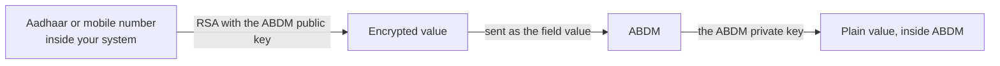

# Encryption

Several fields in [M1](/docs/hiecm/v3/api/m1) do not carry the value you started with. They carry that value encrypted against the ABDM public key. When an API page shows a placeholder such as `<RSA_ENCRYPTED_AADHAAR_NUMBER>`, the field name tells you what the value is and the placeholder tells you it must already be encrypted.

## What must be encrypted

Five kinds of value never travel raw in an M1 request body.

| Value | Where it appears |
| --- | --- |
| Aadhaar number | Enrolment and login by Aadhaar |
| Mobile number | Login, search and mobile update |
| Email address | Email verification |
| One time password ([OTP](/docs/hiecm/v3/getting-started/glossary#otp)) value | Every call that verifies a challenge |
| Password | Password based login |

Each is encrypted with RSA using the ABDM public certificate, and the base64 of the ciphertext goes in the field.

## How the model works

We publish the public half of a key pair. You encrypt with it. Only our private half can decrypt. Your system never holds a secret to do this, only the current certificate.

There is nothing ABDM specific in the mechanics. Your platform's standard RSA library does the work. The two things to confirm are which key you are using and which padding.

## Where to do it

**Encrypt inside your own system, against the published ABDM public key.** This is the production path, and it is the only one that keeps the guarantee the encryption exists to provide.

A hosted helper that encrypts a value for you also exists, along with two third party encryption websites. Those exist so someone can try a flow by hand. They are not a production path.

The reason is worth stating plainly. To use the helper you send the raw Aadhaar or mobile number to a remote endpoint. That hands the value to a party which has no reason to hold it, which is the thing the encryption exists to prevent. With the third party websites it is worse: a patient identifier leaves ABDM entirely.

The [encrypt value endpoint](/docs/hiecm/v3/api/m1) documents the helper for completeness. Do not build against it.

## Fetching the public key

M1 has a `public/certificate` API for fetching the public key, listed again under developer utilities. Its URL, headers and response shape are not yet published. Take them from the sandbox documentation.

## Where to go next

- [Gateway](/docs/hiecm/v3/concepts/gateway) for the session token every call needs, including the key and helper endpoints.
- [M1 user journeys](/docs/hiecm/v3/milestones/m1), where the encrypted identifier appears in the search and login steps.
