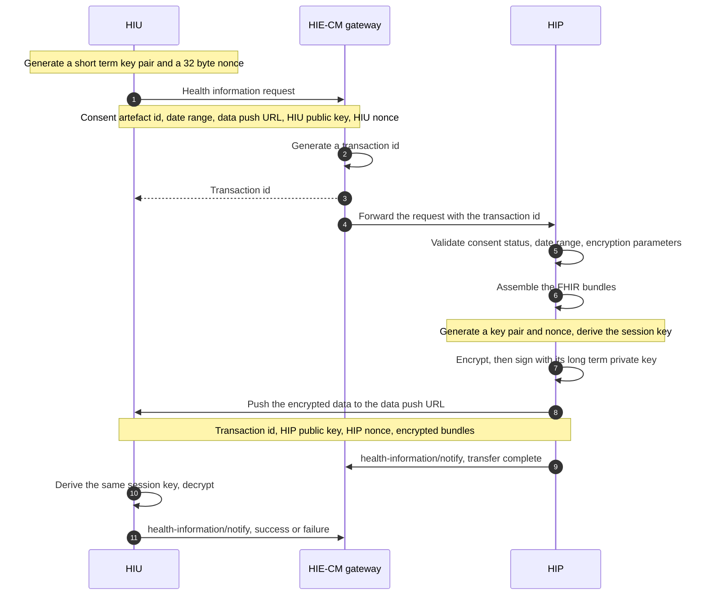

# How a record travels

In [ABDM](/docs/hiecm/v3/getting-started/glossary#abdm) the request goes through the [gateway](/docs/hiecm/v3/getting-started/glossary#gateway) and the [HIE-CM](/docs/hiecm/v3/getting-started/glossary#hie-cm), because that is where consent is checked and routing lives. The record itself goes straight from the system that holds it to a URL the requester nominated, encrypted so only the requester can open it.

## The two sides

| Role                                               | Who takes it                               | What it does here                                                                                                                                             | Milestone                   |
| -------------------------------------------------- | ------------------------------------------ | ------------------------------------------------------------------------------------------------------------------------------------------------------------- | --------------------------- |
| [HIU](/docs/hiecm/v3/getting-started/glossary#hiu) | The organisation or citizen asking         | Holds a granted [consent artefact](/docs/hiecm/v3/getting-started/glossary#consent-artefact), asks for the records it covers, receives them and decrypts them | [M3](/docs/hiecm/v3/api/m3) |
| [HIP](/docs/hiecm/v3/getting-started/glossary#hip) | The citizen or facility holding the record | Holds the records, validates the consent, packages, encrypts, signs and pushes                                                                                | [M2](/docs/hiecm/v3/api/m2) |

The HIE-CM sits between them for the request and the notifications, and never sees a record.

## The whole path

## Stage 1: the request

The HIU sends a health information request through the gateway, quoting a consent artefact the patient granted. It carries four things.

- **The consent id**, the artefact that authorises the request.
- **The data push URL**, where the HIP sends the records. It may differ from the HIU's registered gateway URL, which improves privacy and anonymity.
- **The date and time range** of records wanted.
- **The encryption parameters**: the HIU's public key and its nonce.

The HIE-CM generates a transaction id and gives it to both sides, which is how you correlate a push arriving later with a request you sent earlier.

## Stage 2: validation, then transfer

Before the HIP retrieves anything it runs three checks.

1. **The consent id is valid and active.** Not expired, not paused, not revoked.
2. **The requested date and time range falls inside the range the consent artefact permits.** A wider window is refused, not trimmed.
3. **The encryption parameters are correct and compatible.**

Only then does it package the records as [FHIR](/docs/hiecm/v3/getting-started/glossary#fhir) bundles, encrypt, sign with its long term private key, and send with the transaction id to the data push URL.

Two failures land here: `ABDM-1062`, consent not granted, and `ABDM-1063`, date range given is invalid. Both codes also appear against a linking message, so read the code with the message.

## Stage 3: the notifications that close it

Both sides call `health-information/notify`: the HIP to say the data was transmitted, the HIU to report success or failure on its side. Neither carries the record. They carry the fact that a transfer happened, which is what makes the exchange auditable for the patient.

## Timing and size

| Constraint       | Rule                                                                                     |
| ---------------- | ---------------------------------------------------------------------------------------- |
| Timeout          | 20 minutes from the start of the request                                                 |
| Large datasets   | Split into multiple parts, for example CT or MRI images running to hundreds of megabytes |
| Very large files | Stream rather than sending one payload                                                   |

Treat retrieval and encryption as a background job, not work inside a web request.

## The encryption

The scheme is [Elliptic Curve Diffie-Hellman](/docs/hiecm/v3/getting-started/glossary#ecdh) key exchange on Curve25519, with AES-GCM for the payload and HKDF to derive the session key. Only the HIU holding valid consent can read the data, and the design gives perfect forward secrecy: key material compromised later does not expose data exchanged earlier.

### Who holds which key

| Key material                          | Generated by                   | Where it goes                                      |
| ------------------------------------- | ------------------------------ | -------------------------------------------------- |
| Short term private key, DHSK(U)       | HIU                            | Never leaves the HIU                               |
| Short term public key, DHPK(U)        | HIU                            | Sent with the request                              |
| Nonce, RAND(U), 32 bytes              | HIU                            | Sent with the request                              |
| Short term private key, DHSK(P)       | HIP                            | Never leaves the HIP                               |
| Short term public key, DHPK(P)        | HIP                            | Sent with the encrypted data                       |
| Nonce, RAND(P), 32 bytes              | HIP                            | Sent with the encrypted data                       |
| Shared key, DHK(U,P)                  | Computed independently by both | Never transmitted                                  |
| Session key, SK(U,P), 256 bit AES-GCM | Derived independently by both  | Never transmitted                                  |
| Long term private key                 | HIP                            | Never leaves the HIP. Signs the encrypted payload. |

A new key pair per exchange is what buys forward secrecy.

### What the HIP does, step by step

Six steps, once consent has validated.

1. Generate a key pair, DHSK(P) and DHPK(P), in the group the HIU specified.
2. Generate a 32 byte random value, RAND(P).
3. Compute the shared key DHK(U,P) from the HIU's public key DHPK(U) and the HIP's own private key DHSK(P).
4. Derive the salt and IV by XOR of RAND(P) and RAND(U). The first 20 bytes are the salt for HKDF, the last 12 bytes the IV.
5. Compute a 256 bit AES-GCM session key SK(U,P) with HKDF, from the shared key and that salt.
6. Encrypt the data with that key and that IV.

The HIP then sends DHPK(P), RAND(P) and the encrypted data. The HIU derives the same session key from its own private key DHSK(U) and the HIP's public key DHPK(P), with salt and IV from the same XOR.

Build the shared key from the HIU's public key and the HIP's private key. That is the pairing that makes the Diffie-Hellman exchange work.

### Do not write this yourself

Two reference implementations exist. Fidelius, at [github.com/sukreet/fidelius](https://github.com/sukreet/fidelius), and the Fidelius CLI, which is Java, with worked examples for Node.js, Python, Ruby and PHP at [github.com/mgrmtech/fidelius-cli](https://github.com/mgrmtech/fidelius-cli/tree/main/examples) that run the binary as a subprocess. A webinar covers the CLI from both sides, at [youtu.be/rSir2gbkEmk](https://youtu.be/rSir2gbkEmk?t=9232) from 2:33:52.

## Where this is implemented

- [Hospital, lab and pharmacy systems](/docs/hiecm/v3/concepts/hip-hiu), which side the facility you act for is on.
- [M2, linking and sharing](/docs/hiecm/v3/api/m2), the sending side.
- [M3, consent and fetching](/docs/hiecm/v3/api/m3), the receiving side.
- [Consent](/docs/hiecm/v3/concepts/consent), the artefact this flow depends on.
- [FHIR and health record formats](/docs/hiecm/v3/concepts/fhir), what is inside the payload.
