# M1 Create: ABHA identity

Milestone 1 is the identity milestone of [ABDM](/docs/hiecm/v3/getting-started/glossary#abdm). You create an [ABHA](/docs/hiecm/v3/getting-started/glossary#abha) for a person, log that person in, and read or update their profile. An ABHA number is a 14 digit identifier issued after a [KYC](/docs/hiecm/v3/getting-started/glossary#kyc) check. Every other ABDM flow assumes the person already has one, so nobody skips M1.

[Try the M1 APIs](/docs/hiecm/v3/api/m1)

[Every call in M1, one page each: the headers it needs, the payload it takes, the callback it triggers, and a request builder you can fire at the sandbox.](/docs/hiecm/v3/api/m1)

[Error codes](/docs/hiecm/v3/api/m1/errors)

[What each code M1 returns actually means, and the first thing to check when you see one.](/docs/hiecm/v3/api/m1/errors)

## In short

- M1 is identity only. It creates and authenticates an ABHA. It moves no health records.
- Nothing runs until the gateway session call returns an access token.
- Two tokens exist and are not interchangeable: the gateway token in `Authorization`, the user token in `X-token`. NHA's recorded login response gives the user token thirty minutes (`expiresIn: 1800`) and its refresh token fifteen days (`refreshExpiresIn: 1296000`). Read both back from the response rather than assuming them, and plan a refresh before the thirty minutes run out.
- Aadhaar numbers, mobile numbers, [OTP](/docs/hiecm/v3/getting-started/glossary#otp) values and passwords travel RSA encrypted.

## What M1 gives you

| Capability         | What your system can do                                                              |
| ------------------ | ------------------------------------------------------------------------------------ |
| Session and tokens | Get an access token, refresh it, fetch the public certificate                        |
| ABHA creation      | Verify the person against Aadhaar, attach a mobile number and an ABHA address        |
| ABHA login         | Sign in a holder by mobile number, Aadhaar number, ABHA number or ABHA address       |
| Profile management | Read the profile, show the ABHA card and QR code, change the mobile number, redo KYC |
| Scan and share     | Register a patient who scanned your counter QR code, and hand them a queue token     |

M1 moves no health records. [M2 Attach](/docs/hiecm/v3/milestones/m2) links them. [M3 Retrieve](/docs/hiecm/v3/milestones/m3) fetches them with consent.

## Who needs it

Everyone. A facility publishing as the [HIP](/docs/hiecm/v3/getting-started/glossary#hip), an organisation fetching as the [HIU](/docs/hiecm/v3/getting-started/glossary#hiu), and a citizen using a [PHR](/docs/hiecm/v3/getting-started/glossary#phr) app all hold the session token M1 issues and key their work to an ABHA address.

## Building blocks you use

- The [ABHA registry](/docs/hiecm/v3/registries), which holds the ABHA number, address and profile.
- The [HIE-CM](/docs/hiecm/v3/getting-started/glossary#hie-cm) gateway, which issues your session token. See [The ABDM gateway](/docs/hiecm/v3/concepts/gateway).

Aadhaar is not an ABDM building block. The ABHA service calls it for you.

## Before you start

1. **Sandbox credentials.** A client ID and secret from [Get started](/docs/hiecm/v3/getting-started/sandbox).
2. **An access token.** From the session API, carried on every M1 call.
3. **The public certificate.** The Aadhaar number, the OTP and the mobile number travel encrypted, so fetch the certificate before you encrypt anything.

## What you build, in order

1. **Session and tokens.** Mandatory. Nothing else in M1 runs until this works.
2. **ABHA creation by Aadhaar OTP.** Mandatory.
3. **ABHA login.** Mandatory, on all four entry points.
4. **User profile and ABHA card.** Mandatory. Plain reads against a token you hold.
5. **Demographic authentication.** Mandatory for government integrators, not for private ones. See [creation by demographic authentication](#abha-creation-by-demographic-authentication).

Everything else in M1 is optional for both. Skip all of it and you still complete the milestone. The mandatory and optional split, capability by capability, is on the [M1 API reference](/reference/hiecm-m1).

## Build it with an agent

Hand M1 to the agent you already use, as one file it loads once. Install it, or open it there in one click.

M1 agent skill

Every M1 call, its error codes and its certification cases in one file: 55 operations, 89 codes, 122 cases.

[SKILL.md](/skills/abdm-m1/SKILL.md "The router. Use the command below to take the references with it.")

- ScaffoldThe loop that builds the module flow by flow against the sandbox, ending on an observed result rather than on a call returning 200.
- Integrate55 operations, with their hosts, headers and the rules that hold across them.
- Debug89 recorded error codes, each with its message and what to do about it.
- Test122 test cases, each with the call it makes and what to see when it passes.

`mkdir -p .claude/skills/abdm-m1/references && curl -fsSL https://abdm-docs.dev.eka.care/skills/abdm-m1/SKILL.md -o .claude/skills/abdm-m1/SKILL.md && for f in scaffold integrate debug test; do curl -fsSL https://abdm-docs.dev.eka.care/skills/abdm-m1/references/$f.md -o .claude/skills/abdm-m1/references/$f.md; done`

[Open in Claude](claude://code/new?q=Install%20the%20ABDM%20M1%20agent%20skill%20into%20this%20project%2C%20then%20help%20me%20use%20it.%0A%0ARun%20this%3A%0Amkdir%20-p%20.claude%2Fskills%2Fabdm-m1%2Freferences%20%26%26%20curl%20-fsSL%20https%3A%2F%2Fabdm-docs.dev.eka.care%2Fskills%2Fabdm-m1%2FSKILL.md%20-o%20.claude%2Fskills%2Fabdm-m1%2FSKILL.md%20%26%26%20for%20f%20in%20scaffold%20integrate%20debug%20test%3B%20do%20curl%20-fsSL%20https%3A%2F%2Fabdm-docs.dev.eka.care%2Fskills%2Fabdm-m1%2Freferences%2F%24f.md%20-o%20.claude%2Fskills%2Fabdm-m1%2Freferences%2F%24f.md%3B%20done%0A%0AIf%20this%20session%20did%20not%20open%20in%20the%20repository%20I%20am%20integrating%20ABDM%20into%2C%20ask%20me%20for%20the%20path%20before%20you%20write%20anything.)

Drops the skill into this project. Claude loads it when a task matches.

How to use it

1. Run the command above in the repository you are integrating.
2. Ask your agent for the job in your own words. "Add ABHA creation by Aadhaar OTP to this codebase", "why am I getting ABDM-1001", or "write the M1 tests for this". The skill loads when the task matches it.
3. Check what it writes against these pages. The skill carries the facts, not the sandbox: nothing in it has been run against ABDM.
4. Open in Claude needs that app installed. It fills the composer and waits: nothing runs until you read it and press Enter.

## Certification

M1 has no certification step of its own. One exit process covers the whole integration, run once, after every milestone your role needs works end to end. See [Going live](/docs/hiecm/v3/getting-started/going-live) for the four steps and what each one asks of you.

Sandbox test data is in the [data dictionary](/docs/hiecm/v3/reference/data-dictionary). [Support](/docs/support) lists the channels. The cases you are certified against are in [M1 testing use cases](/docs/hiecm/v3/resources/testing/m1).

## The page map

There are two identities in M1, and which one you are creating decides every call you make after it.

|                            | ABHA with Aadhaar                                                                                   | ABHA address with a mobile number               |
| -------------------------- | --------------------------------------------------------------------------------------------------- | ----------------------------------------------- |
| What the person ends with  | A fourteen digit ABHA number and an ABHA address                                                    | An ABHA address, and no ABHA number             |
| How the profile is marked  | KYC Verified                                                                                        | Self-Declared                                   |
| What proves who they are   | Aadhaar, through one of four routes                                                                 | The mobile number, and nothing beyond it        |
| Who gives the demographics | Aadhaar does                                                                                        | The person types them                           |
| Create it                  | [Four creation routes](#which-creation-route-you-must-build)                                        | [Create the address](#create-the-address)       |
| Log them in                | [By mobile number](#abha-login-by-mobile-number), or by Aadhaar number, ABHA number or ABHA address | [By ABHA address](#log-in-with-an-abha-address) |
| Read the profile           | [Profile, card and QR code](#profile-abha-card-and-quick-response-qr-code)                          | [The PHR profile](#log-in-with-an-abha-address) |
| Build it when              | You register people at a desk and their records must be trusted                                     | The person holds your application themselves    |

The two tracks meet. A Self-Declared profile becomes KYC Verified the moment the person links an ABHA number to it, and from then on it is the first column. Nothing is thrown away in between.

The rest of this page is those two tracks, and then the one route belonging to neither: a patient arriving at your counter with an ABHA they already hold.

"ABHA service" is the ABHA API at the base URL on the [M1 overview](/docs/hiecm/v3/api/m1). Your system never calls Aadhaar. The ABHA service does that for you. The diagrams follow the published step order for each flow.

### Which person is in front of you

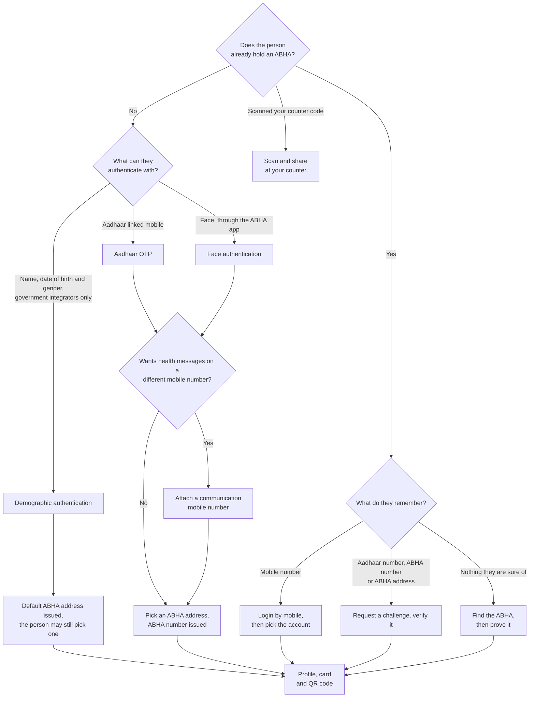

## ABHA with Aadhaar

This track produces the fourteen digit [ABHA number](/docs/hiecm/v3/getting-started/glossary#abha-number). Aadhaar proves who the person is, the ABHA service issues the number, and the person claims an [ABHA address](/docs/hiecm/v3/getting-started/glossary#abha-address) to go with it. Four routes reach it, and they differ only in how Aadhaar is satisfied.

### Which creation route you must build

| Creation route                     | Private integrator | Government integrator           |
| ---------------------------------- | ------------------ | ------------------------------- |
| Aadhaar OTP                        | Mandatory          | Mandatory                       |
| Aadhaar face authentication        | Optional           | Optional                        |
| Aadhaar fingerprint or iris        | Optional           | Optional                        |
| Aadhaar demographic authentication | Not required       | Mandatory                       |
| Child ABHA                         | Not available      | Only on NHA leadership approval |

This table is NHA's, from the proposed simplified M1 flow they supplied with their review of this page on 11 September 2026. Enrolment from an identity document is not in it: NHA does not recommend that route to integrators, and it is described [further down](#create-an-abha-from-a-document-not-recommended) rather than among the routes above, because the call is in the specification and people find it there.

### ABHA creation by an Aadhaar OTP

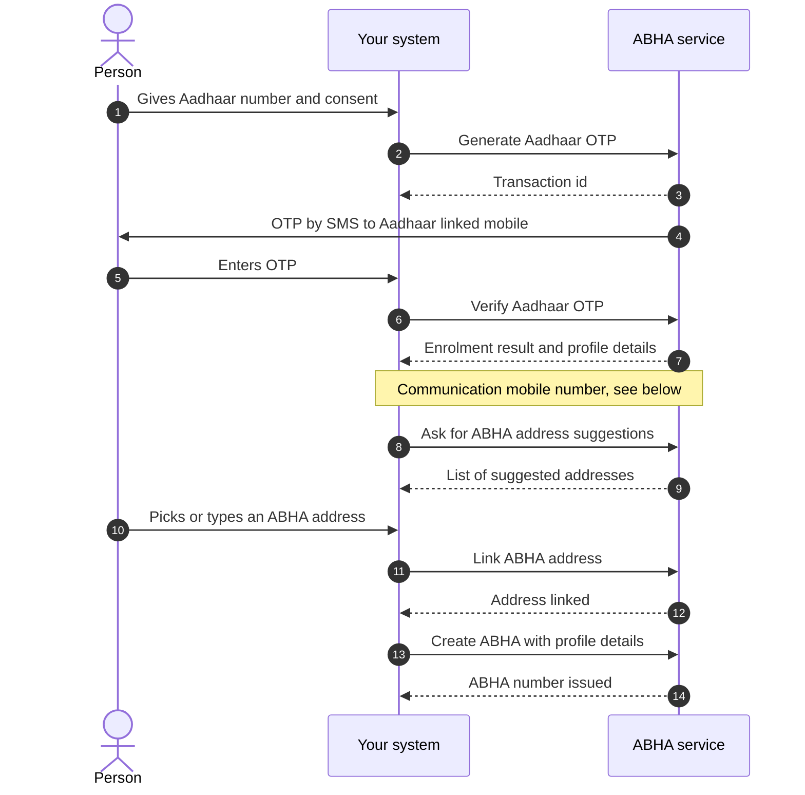

The person gives their Aadhaar number. The ABHA service sends a one time password ([OTP](/docs/hiecm/v3/getting-started/glossary#otp)) to the mobile registered against that Aadhaar. Once it checks out, the person picks a communication mobile number and an ABHA address, and the ABHA number is issued.

Email verification sits between the mobile step and the address step. It is optional, so it is not drawn.

### ABHA creation by face authentication

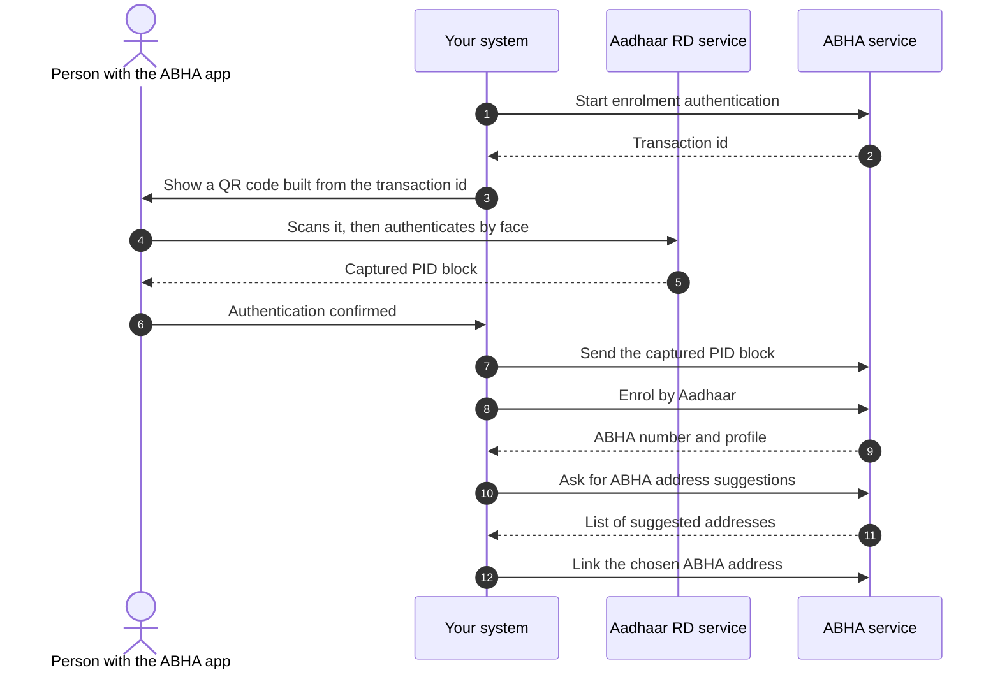

Some people cannot use the OTP route, usually because the mobile registered against their Aadhaar is no longer theirs. Face authentication is the optional alternative. The person authenticates their face through the Aadhaar registered device (RD) service on their own phone, which is how the transaction moves from your screen to theirs.

NHA files both calls in this route under the use case "ABHA creation, Aadhaar biometric", and their summaries read "face or biometric". Fingerprint and iris are a real route: NHA's simplified flow names them as a creation route of their own, optional for every integrator, and the enrolment call takes `bio` and `iris` in `authMethods` beside `face`. What nothing here records is a request that uses them. The only request recorded against either call sends the scope `face-auth`, and nothing has been run against the sandbox either way. Build the face route from the diagram above, treat fingerprint and iris as named by NHA and unproven here, and confirm the capture step with NHA before you design around it.

The middle of this route happens on someone else's device, so your system is waiting on a person rather than on a network call. Show that state clearly instead of a spinner.

The PID block is encrypted by the capture device and it expires. Send it as soon as you receive it rather than storing it.

### ABHA creation by demographic authentication

```mermaid
sequenceDiagram
    autonumber
    actor P as Person
    participant S as Your system
    participant A as ABHA service
    P->>S: Gives Aadhaar number, name, date of birth, gender and consent
    S->>S: Encrypts the Aadhaar number
    S->>A: Enrol by Aadhaar, authMethods demo_auth
    A-->>S: ABHA number, profile and a default ABHA address
    S->>A: Fetch user profile
```

Government integrators build this route. Private ones do not. There is no OTP and no capture device: you send the Aadhaar number together with the name, date of birth and gender recorded against it, and Aadhaar either matches them or does not.

The call is the same `enrol/byAadhaar` the OTP route ends on, with `authMethods` set to `demo_auth` and a `demo_auth` block carrying the encrypted Aadhaar number, the full name as per Aadhaar, the date of birth and the gender.

Two things differ from the OTP route and both bite. The user token comes back as `token` at the top level rather than under `tokens`, so a client that reuses its OTP parsing reads nothing. And the account is issued with a default ABHA address already generated, which is why claiming an address is mandatory on the other routes and optional on this one. The default address is the fourteen digit number followed by `@sbx` or `@abdm`, which nobody can remember, so offer the person a readable address anyway.

The specification calls the programmes that use this route integrated programmes. What a demographic mismatch returns, field by field, is not published; `INVALID_DEMOGRAPHIC_DETAILS` is the error the specification names.

### Create a child ABHA

A parent or guardian can hold ABHA accounts for their children under their own account. NHA releases this route to specific government integrators on its leadership's approval, so a private integration does not get it.

Three calls carry it, and a fourth is named by NHA and is not in the specification this portal holds:

- **Create.** The same `enrol/byAadhaar` call, with `authMethods` set to `child` and a `child` block carrying the child's first and last name, day, month and year of birth and gender, and the parent's ABHA number or ABHA address. The parent is authenticated first, and must be 18 or older.
- **Update.** `PATCH /v3/profile/account` with the child's ABHA number, name, date of birth and gender.
- **List.** `GET /v3/enrollment/profile/children`, which returns the children under the account and their count.
- **KYC of a child ABHA** is named in NHA's simplified flow and has no operation in the specification this portal holds. Ask NHA for it rather than designing around a guess.

Two refusals are worth handling by name before you meet them: a parent under 18, and an account that has already enrolled as many children as it may.

### Create an ABHA from a document, not recommended

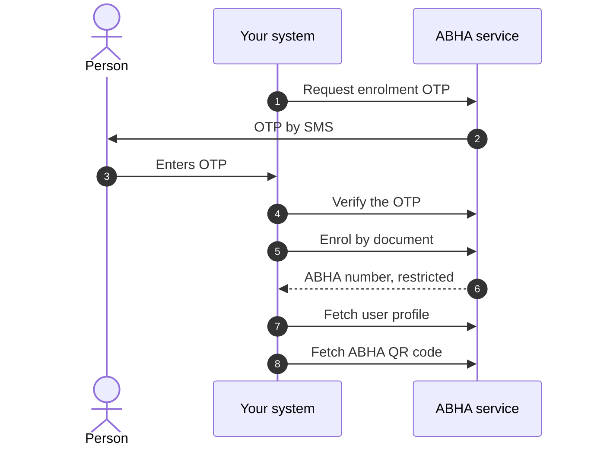

NHA reviewed this page in September 2026 and asked for this route to come out of the recommended flow. It is not in the simplified M1 flow they supplied, and their words are that it is not recommended for integrators. It is kept here, below the recommended routes rather than among them, because the call is in the specification and people find it there.

When neither an Aadhaar OTP nor a face capture is possible, the person can be enrolled from an identity document. NHA's own collection uses a driving licence.

The account this produces is restricted until it is upgraded through Aadhaar know your customer (KYC) verification. If you build the route anyway, tell the person that when the account is created, rather than letting them find out when something later fails.

### Attach a communication mobile number

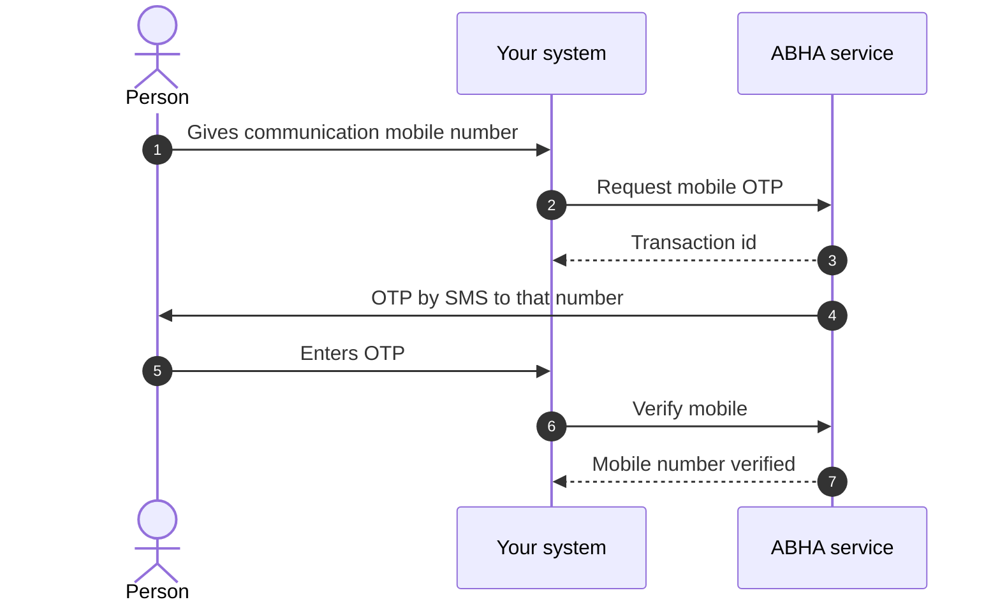

The Aadhaar linked number is not always the number the person wants health messages on. This flow runs after enrolment on every creation route.

A person may give the number already linked to their Aadhaar. Whether that path sends a second OTP is not yet published.

### ABHA login by mobile number

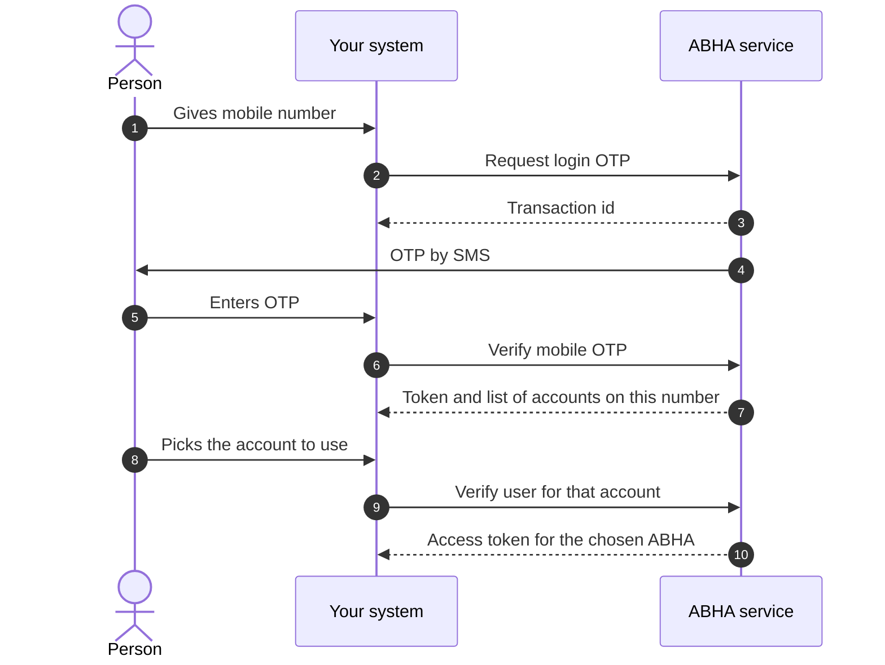

One mobile number can hold more than one ABHA, so this flow has a third step where the person says which account they mean.

Login by Aadhaar number, by ABHA number and by ABHA address follow the same two beats: request a challenge, then verify it. The challenge can be an Aadhaar OTP, a mobile OTP, a fingerprint or IRIS capture, or a face authentication scan. [API reference](/reference/hiecm-m1) lists which routes are mandatory.

### Find an ABHA the person has forgotten

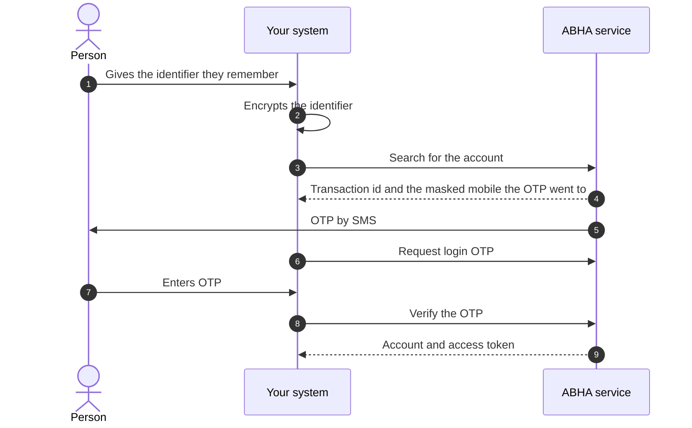

People forget their ABHA. This route finds it from something they do remember, usually a mobile number, then makes them prove the account is theirs before anything is handed over. The proof step is the point, because a search on its own only tells you that an account exists.

The search response names the masked mobile the OTP was sent to, for example one ending `0161`. Show that to the person so they can confirm the number is theirs before they sit waiting for a message that will not arrive.

Encrypt the identifier inside your own system. Do not send the identifier to a remote encryption helper or a third party site; that hands a patient identifier to a party that has no reason to hold it. See [encryption](/docs/hiecm/v3/concepts/encryption) for how to do it locally.

### Profile, ABHA card and quick response (QR) code

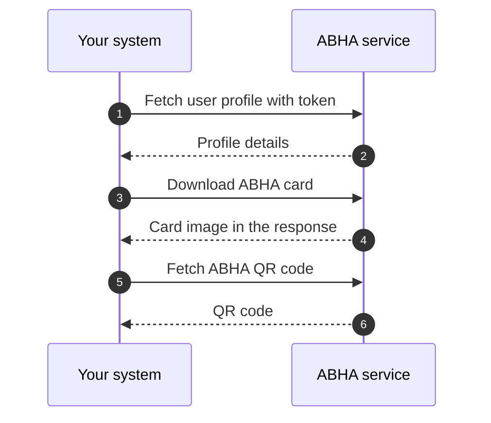

Once you hold a token for a person, the profile reads are plain calls. Get profile, QR code and card download form one set.

The card is returned in the response rather than fetched from a separate link. The content type and encoding of the card and QR code responses are not yet published. See the [APIs](/docs/hiecm/v3/api/m1/apis) page for the fields that are.

## ABHA address with a mobile number

A mobile number on its own does not reach an ABHA number. Every creation route above proves the person against Aadhaar, or against an identity document on the route NHA no longer recommends, and the number is issued off the back of that.

It does reach an [ABHA address](/docs/hiecm/v3/getting-started/glossary#abha-address). The person verifies a mobile number by [OTP](/docs/hiecm/v3/getting-started/glossary#otp), types their own demographics, and ends with an address, no ABHA number, and a profile marked Self-Declared.

Nothing in this track is reserved for one kind of integrator. It takes the same gateway session token as everything else in M1, and nothing in the specification this portal holds says only a [PHR](/docs/hiecm/v3/getting-started/glossary#phr) application may call it. What decides whether you build it is what you are building, not what you are registered as.

### Create the address

The calls are the enrolment set in [the P1 reference](/docs/hiecm/v3/api/p1), written up as [creating an ABHA address](/docs/hiecm/v3/milestones/p1#creating-an-abha-address).

The person verifies the mobile number by OTP, then types the demographics the ABHA service would otherwise have taken from Aadhaar. First name, year of birth, gender, address, state, district and pin code are mandatory; middle name, last name and the day and month of birth are not. Before creating anything, list the addresses already linked to that mobile number and let the person pick one: a second address for somebody who already has one is the most common thing that goes wrong here.

### Log in with an ABHA address

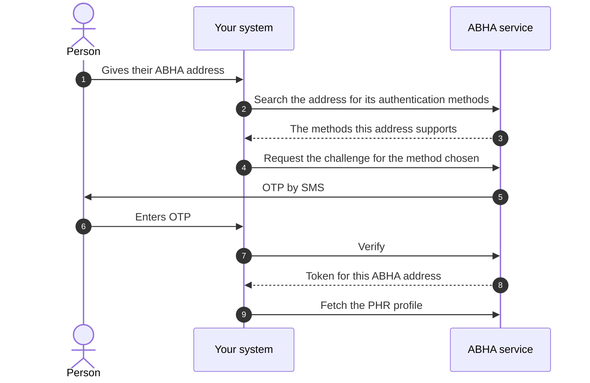

Logging in by ABHA address is its own set of calls, under `/v3/phr/web/login/abha`, and it is the way into a profile that has no ABHA number behind it. Ask first and authenticate second: [search the ABHA address](/docs/hiecm/v3/api/m1/endpoints/m1-phr-search-abha-address) returns the authentication methods that address supports, which is what stops you offering an Aadhaar OTP to a profile with no Aadhaar behind it.

The [OTP request](/docs/hiecm/v3/api/m1/endpoints/m1-phr-request-otp) carries a `scope` pair naming the method: `abha-address-login` with `mobile-verify` for a mobile OTP, `abha-address-login` with `aadhaar-verify` for an Aadhaar OTP, and `abha-login` with `aadhaar-bio-verify`, `aadhaar-face-verify` or `aadhaar-iris-verify` for the three biometric methods. The ABHA address travels encrypted, the same way every other identifier does.

Once it verifies, the [PHR profile](/docs/hiecm/v3/api/m1/endpoints/m1-get-phr-profile) and the PHR card and QR code read against the token it returns.

### What Self-Declared costs, and what ends it

A Self-Declared profile carries no [KYC](/docs/hiecm/v3/getting-started/glossary#kyc). Nothing has proved the person is who they say they are, so a facility cannot hang a record it has to trust on one. An [ABHA number](/docs/hiecm/v3/getting-started/glossary#abha-number) appears only when the person links one later, and linking turns the same profile KYC Verified without losing what was already on it.

Which is what should decide where you start people. A hospital system registering a walk-in patient wants the KYC verified identity the Aadhaar track produces. An application the person holds themselves can start them on a mobile number and ask for Aadhaar later, which is a much shorter first screen and a much smaller reason to abandon it.

## A patient shares their profile at your counter

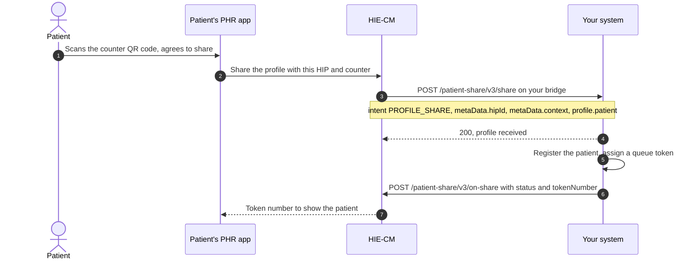

Your facility prints a QR code at each counter. It holds a URL with two parameters: your HIP id and a counter context such as `OPD1`. The patient scans it in their [PHR](/docs/hiecm/v3/getting-started/glossary#phr) app, agrees to share, and their profile arrives on your bridge. Nobody types a name at the desk, and every record from that visit links to the right ABHA address from the start.

Step 3 is a callback on the URL registered for your bridge, not a call you make. Answer it with a 200 at once and do the registration afterwards. Step 7 is your reply: `acknowledgement.status` is `SUCCESS` with `profile.tokenNumber` and the same `context`, or `FAILURE` with an `error` code and message.

The patient's app holds its screen open for 30 seconds. Send the acknowledgement inside that window or the patient sees no token.

`profile.patient` carries the ABHA number, the ABHA address, name, gender, date of birth, mobile number, address and a KYC photo. Match on the ABHA address. The counter context is yours to define: up to 20 alphanumeric characters, and never the facility id, the HIP id or the HIP name.

The two calls: [receive a patient's shared profile](/docs/hiecm/v3/api/m1/endpoints/m1-receive-patient-share) and [send the share acknowledgement](/docs/hiecm/v3/api/m1/endpoints/m1-on-share-acknowledgement). The patient's side is [P2 Linking and records](/docs/hiecm/v3/milestones/p2#scan-and-share-at-a-facility).

## Next

- The flows as diagrams: [the page map](#the-page-map).
- The calls, base URLs and error shapes: [M1 API reference](/docs/hiecm/v3/api/m1).
- The next milestone: [M2 Attach](/docs/hiecm/v3/milestones/m2).
