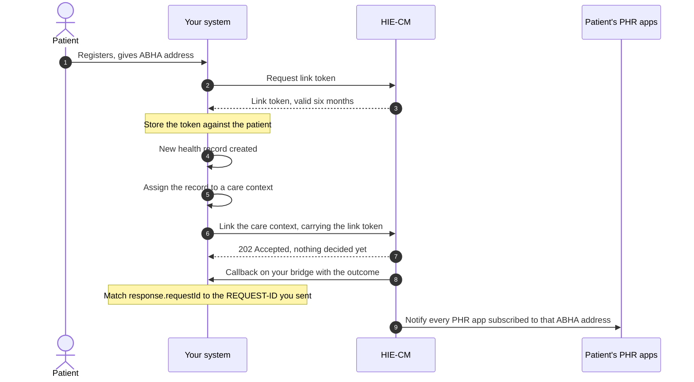
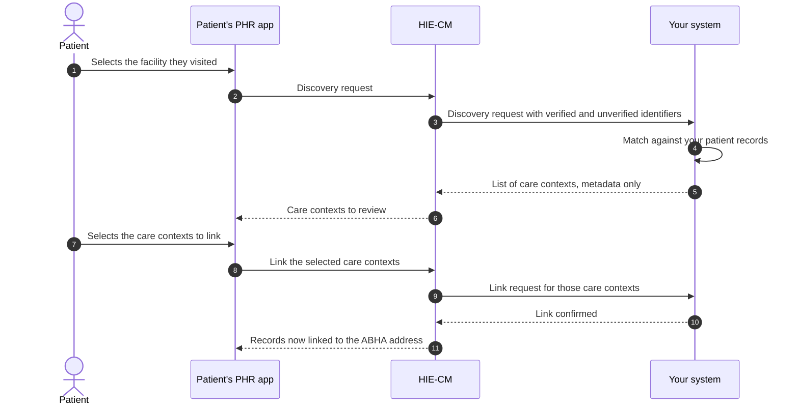
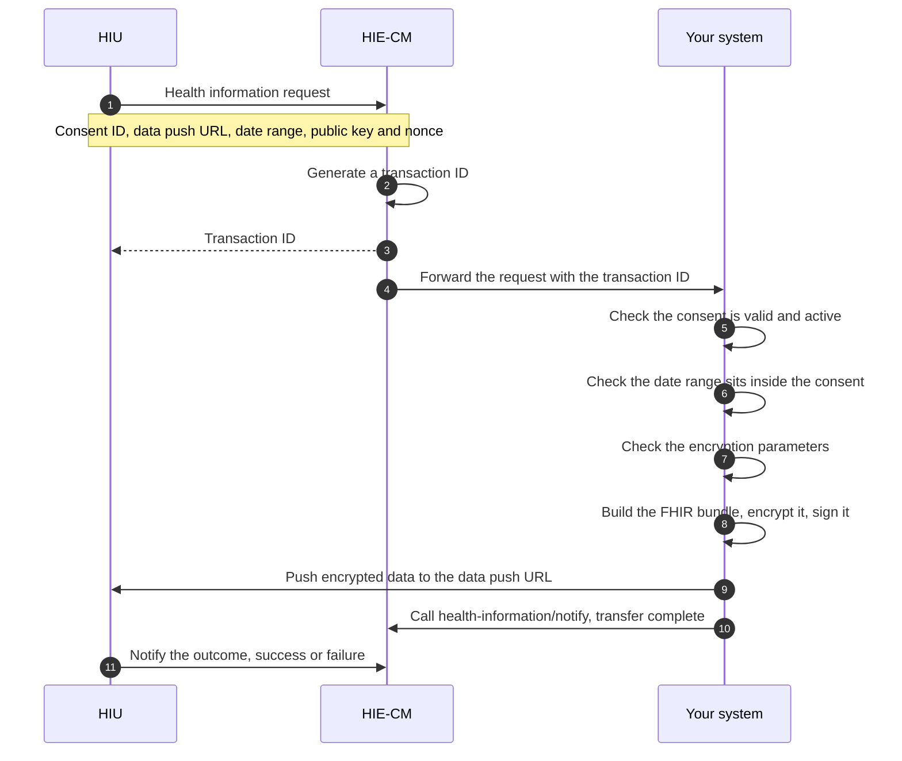

# M2 Attach: Health Information Provider Services

Milestone 2 enables a [Health Information Provider](/docs/hiecm/v3/getting-started/glossary#hip) (HIP) to create digital health records and to generate and link [care contexts](/docs/hiecm/v3/getting-started/glossary#care-context) with a patient's [ABHA Address](/docs/hiecm/v3/getting-started/glossary#abha-address). It also enables the HIP to facilitate record [discovery](/docs/hiecm/v3/getting-started/glossary#discovery) through a Personal Health Record ([PHR](/docs/hiecm/v3/getting-started/glossary#phr)) application, and to securely share encrypted health information across the ABDM ecosystem.

[Try the M2 APIs](/docs/hiecm/v3/api/m2)

[Every call in M2, one page each: the headers it needs, the payload it takes, the callback it triggers, and a request builder you can fire at the sandbox.](/docs/hiecm/v3/api/m2)

[Error codes](/docs/hiecm/v3/api/m2/errors)

[What each code M2 returns actually means, and the first thing to check when you see one.](/docs/hiecm/v3/api/m2/errors)

## In short

Milestone 2 enables a Healthcare Facility, acting as a Health Information Provider (HIP), to link a patient's health records with the patient's ABHA Address and make such records available within the ABDM ecosystem. The linkage of records may be carried out through either HIP-Initiated Linking or User-Initiated Linking.

- **HIP-Initiated Linking.** In this workflow, an ABDM-enabled Healthcare Facility links the patient's health records and care contexts with the patient's ABHA Address during the course of care, following successful patient authentication. The linked records are subsequently made available through the patient's PHR application.
- **User-Initiated Linking.** In this workflow, a patient initiates the linkage of previously generated health records through a PHR application. The HIP validates the patient details, identifies the corresponding records, and links the associated care contexts with the patient's ABHA Address upon successful verification.
- **Data Transfer.** Health information is structured in accordance with the HL7 [FHIR](/docs/hiecm/v3/getting-started/glossary#fhir) R4 standard. The FHIR bundle is encrypted and securely exchanged through the ABDM ecosystem.

## Capabilities under M2

The following capabilities shall be supported by an ABDM-compliant HIP system, as applicable to the integrating entity.

| Capability                              | What it enables                                                                                                                                                                         |
| --------------------------------------- | --------------------------------------------------------------------------------------------------------------------------------------------------------------------------------------- |
| Care contexts                           | Organise health records relating to a visit, admission or other episode of care into an identifiable care context that can be linked with the patient's ABHA Address.                   |
| HIP-initiated linking                   | Enables a Healthcare Facility to link a patient's health records with the patient's ABHA Address at the point of care, following successful verification of the patient's ABHA Address. |
| Notification to mobile                  | Enables the HIP to notify the patient upon successful linkage of health records.                                                                                                        |
| Discovery and linking                   | Enables the identification and linkage of a patient's previously generated health records with the patient's ABHA Address through a discovery request initiated via a PHR application.  |
| Health-information request and transfer | Enables the secure, consent-based exchange of a patient's health records in ABDM-prescribed HL7 FHIR R4 format within the ABDM ecosystem.                                               |

## Who needs it

M2 is applicable to healthcare facilities and systems that create and maintain digital health records, including hospitals, clinics, laboratories, pharmacies and diagnostic or imaging centres. A citizen pushing their own records from a PHR app builds [P2 Linking and records](/docs/hiecm/v3/milestones/p2), the patient side of M2.

## Prerequisites

Prior to implementation of Milestone 2, the following requirements shall be fulfilled:

1. The Healthcare Facility shall have a valid Health Facility Registry ([HFR](/docs/hiecm/v3/getting-started/glossary#hfr)) ID, and the integrating software shall be registered and mapped to the facility as a Health Information Provider (HIP).
2. The system shall support capture and verification of the patient's ABHA Address through the applicable ABDM authentication mechanism.
3. The system shall generate and maintain digital health records for linking with the patient's ABHA Address.
4. Health information shall be packaged in HL7 FHIR R4 format and conform to the applicable ABDM FHIR profiles published by NRCeS at [nrces.in](https://nrces.in/ndhm/fhir/r4/index.html).

## Record types you can link

Each applicable health-information type shall be represented as a [FHIR](/docs/hiecm/v3/getting-started/glossary#fhir) document Bundle. Depending on the applicable profile and use case, the Bundle may contain structured clinical data and, where permitted, an attachment such as a PDF document or image.

| Record type              | What it holds                                                             |
| ------------------------ | ------------------------------------------------------------------------- |
| Diagnostic Report Record | Radiology and laboratory reports                                          |
| Discharge Summary Record | The discharge summary for the ABDM health data set                        |
| Health Document Record   | Unstructured historical records, usually uploaded through a health locker |
| Immunization Record      | Immunisations, vaccine certificates and next dose recommendations         |
| OP Consult Record        | Outpatient notes: examinations, procedures, medications and advice        |
| Prescription Record      | Medication advice, following Pharmacy Council of India guidelines         |
| Wellness Record          | Vitals, physical examination and general health data captured in PHR apps |
| Invoice Record           | Pharmacy invoices, consultation invoices and other billing records        |

## Build M2 with an AI coding assistant

The M2 skill gives an AI coding assistant this milestone as one file: every M2 call and callback, its error codes and its test cases. Install it, or open it in your assistant in one click.

M2 agent skill

Every M2 call and callback, its error codes and its certification cases in one file: 31 operations, 120 codes, 46 cases.

[SKILL.md](/skills/abdm-m2/SKILL.md "The router. Use the command below to take the references with it.")

- ScaffoldThe loop that builds the module flow by flow against the sandbox, ending on an observed result rather than on a call returning 200.
- Design
- Integrate32 operations, with their hosts, headers and the rules that hold across them.
- DebugNo error code is recorded for this module yet.

`mkdir -p .claude/skills/abdm-m2/references && curl -fsSL https://abdm-docs.dev.eka.care/skills/abdm-m2/SKILL.md -o .claude/skills/abdm-m2/SKILL.md && for f in scaffold design integrate debug; do curl -fsSL https://abdm-docs.dev.eka.care/skills/abdm-m2/references/$f.md -o .claude/skills/abdm-m2/references/$f.md; done`

[Open in Claude](claude://code/new?q=Install%20the%20ABDM%20M2%20agent%20skill%20into%20this%20project%2C%20then%20help%20me%20use%20it.%0A%0ARun%20this%3A%0Amkdir%20-p%20.claude%2Fskills%2Fabdm-m2%2Freferences%20%26%26%20curl%20-fsSL%20https%3A%2F%2Fabdm-docs.dev.eka.care%2Fskills%2Fabdm-m2%2FSKILL.md%20-o%20.claude%2Fskills%2Fabdm-m2%2FSKILL.md%20%26%26%20for%20f%20in%20scaffold%20design%20integrate%20debug%3B%20do%20curl%20-fsSL%20https%3A%2F%2Fabdm-docs.dev.eka.care%2Fskills%2Fabdm-m2%2Freferences%2F%24f.md%20-o%20.claude%2Fskills%2Fabdm-m2%2Freferences%2F%24f.md%3B%20done%0A%0AIf%20this%20session%20did%20not%20open%20in%20the%20repository%20I%20am%20integrating%20ABDM%20into%2C%20ask%20me%20for%20the%20path%20before%20you%20write%20anything.)

Drops the skill into this project. Claude loads it when a task matches.

How to use it

1. Run the command above in the repository you are integrating.
2. Ask your agent for the job in your own words. "Link a care context for this patient". The skill loads when the task matches it.
3. Check what it writes against these pages. The skill carries the facts, not the sandbox: nothing in it has been run against ABDM.
4. Open in Claude needs that app installed. It fills the composer and waits: nothing runs until you read it and press Enter.

## Workflow overview

This section presents the principal M2 workflows through separate sequence diagrams to provide an overview of the interactions among the participating systems before the detailed API specifications are described.

For the diagrams, "Your system" refers to the [HMIS](/docs/hiecm/v3/getting-started/glossary#hmis), [LMIS](/docs/hiecm/v3/getting-started/glossary#lmis), [EMR](/docs/hiecm/v3/getting-started/glossary#emr) or other ABDM-compliant software used by the health facility to perform HIP functions. "HIE-CM" refers to the Health Information Exchange and Consent Manager that facilitates consent management and the secure exchange of health information within the ABDM ecosystem.

## Journey 1: HIP-initiated linking

The HIP generates a [link token](/docs/hiecm/v3/getting-started/glossary#link-token) using the patient's ABHA address and demographic details, which is then shared with the patient for authentication. Upon successful verification, a linking token valid for 6 months is created, and the patient's care context is linked to the corresponding ABHA address.

Step 8 is the acknowledgement. Step 9 is the answer. The link is confirmed only when the callback arrives at `/api/v3/link/on_carecontext` on your bridge, so do not mark a record as linked on the strength of the 202. See [the outcome of a care context linking call](/docs/hiecm/v3/api/m2/endpoints/m2-abdm-hip-initiated-linking-hip/02-m2-post-v3-link-on-carecontext).

Which steps are callbacks?

A step drawn from the HIE-CM to your system is a POST to the callback URL registered for your bridge. It arrives on its own. Do not poll for it.

If you hold no valid link token for the patient, generate a new one with the patient's ABHA address and demographic details before you link.

## Journey 2: User-initiated linking

The patient starts discovery from a PHR app and picks the facility they visited. Your system matches them on the verified and unverified identifiers the gateway passes you, and answers with care contexts.

Step 5 returns eligible care-context metadata without disclosing clinical content: no diagnosis, no test result, no report content.

Steps 8 to 11 are the link init and confirm requests, answered by your `on-init` and `on-confirm` callbacks. Their fields are on the [M2 API reference](/docs/hiecm/v3/api/m2).

## Journey 3: Health information request and transfer

Another facility, an insurer or a citizen's PHR app asks for records under a [consent artefact](/docs/hiecm/v3/getting-started/glossary#consent-artefact) the patient granted. Whoever asks is the [HIU](/docs/hiecm/v3/getting-started/glossary#hiu).

The HIU supplies the data push URL and its key material in the request. Encryption uses [ECDH](/docs/hiecm/v3/getting-started/glossary#ecdh), Elliptic Curve Diffie Hellman, over Curve25519. Call order: [M2 API reference](/docs/hiecm/v3/api/m2).

## Next

- Requesting records from other facilities is [M3 Retrieve](/docs/hiecm/v3/milestones/m3).
- The calls, callbacks and error codes: [M2 API reference](/docs/hiecm/v3/api/m2).
- The cases M2 is tested against: the certification pack NHA issues. Certification runs once, for the whole integration: [Go live](/docs/hiecm/v3/getting-started/going-live).
