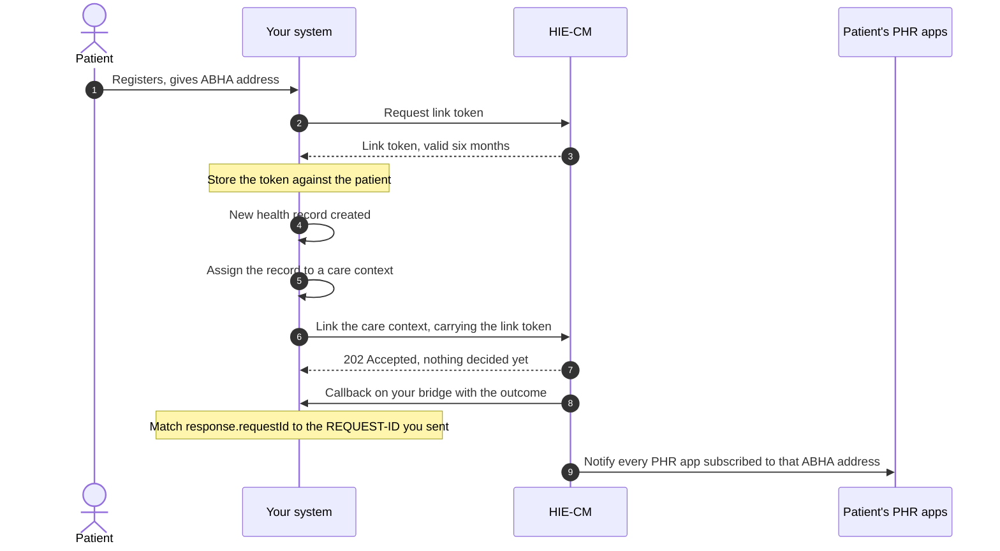
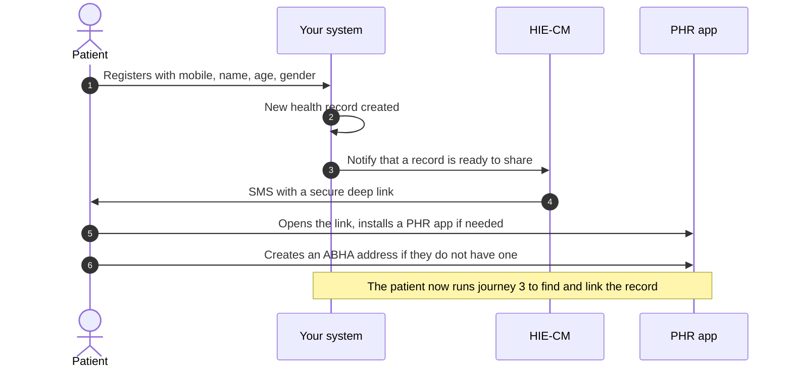
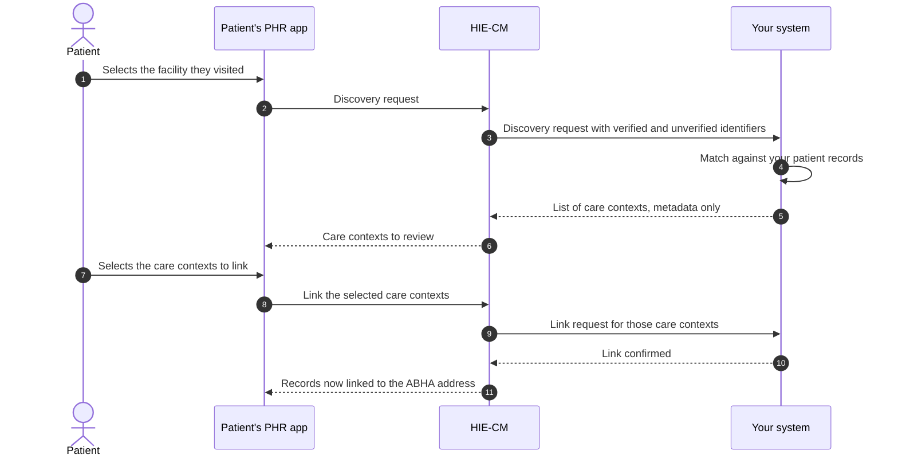
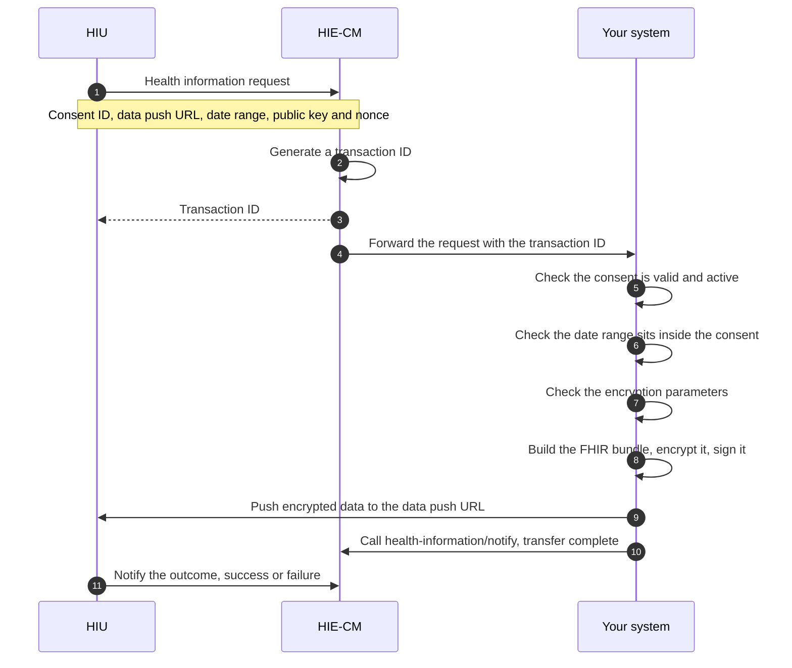

# M2 Attach: linking and sharing

Milestone 2 attaches the health records you hold to a person's [ABHA address](/docs/hiecm/v3/getting-started/glossary#abha-address). After it you can group records into [care contexts](/docs/hiecm/v3/getting-started/glossary#care-context), link them, answer [discovery](/docs/hiecm/v3/getting-started/glossary#discovery) requests from [PHR](/docs/hiecm/v3/getting-started/glossary#phr) apps, and push encrypted records when a consented request arrives.

[Try the M2 APIs](/docs/hiecm/v3/api/m2)

[Every call in M2, one page each: the headers it needs, the payload it takes, the callback it triggers, and a request builder you can fire at the sandbox.](/docs/hiecm/v3/api/m2)

[Error codes](/docs/hiecm/v3/api/m2/errors)

[What each code M2 returns actually means, and the first thing to check when you see one.](/docs/hiecm/v3/api/m2/errors)

## In short

- Your facility is the [HIP](/docs/hiecm/v3/getting-started/glossary#hip) when it publishes a record, and your software is how it publishes. A valid facility ID and registration in the HIP role come first, either from the NHPR portal by hand or by building [M4 Enrol](/docs/hiecm/v3/milestones/m4).
- M2 is keyed to an ABHA address, so [M1 Create](/docs/hiecm/v3/milestones/m1) has to work before M2 can.
- Hold a [link token](/docs/hiecm/v3/getting-started/glossary#link-token) per patient. Its validity is six months.
- Records go out as [FHIR](/docs/hiecm/v3/getting-started/glossary#fhir) R4 against the ABDM profiles.
- Four callbacks name a path and carry no documented payload. Do not assume a body.

## What M2 gives you

| Capability                | What your system can do                                                                         |
| ------------------------- | ----------------------------------------------------------------------------------------------- |
| Care contexts             | Group each visit or admission into a named unit that can be linked to an ABHA address           |
| HIP initiated linking     | Link a care context yourself, when the patient gave you their ABHA address at registration      |
| Notification to mobile    | Make a record findable when you hold only a mobile number, a name, an age and a gender          |
| Discovery                 | Answer a patient's search for their records at your facility, and let them link what you return |
| Data request and transfer | Receive a consented request, package the records, encrypt them, and push them to the requester  |

Requesting records from other facilities is [M3 Retrieve](/docs/hiecm/v3/milestones/m3).

## Who needs it

Hospitals, laboratories, pharmacies and imaging centres, through the software they record care in. A citizen pushing their own records from a PHR app builds [P2 Linking and records](/docs/hiecm/v3/milestones/p2), the patient side of M2.

## Prerequisites

1. A valid facility ID and registration in the HIP role. That authorises your facility to create health records and share them with whoever asks to read them as the [HIU](/docs/hiecm/v3/getting-started/glossary#hiu). It comes from [M4 Enrol](/docs/hiecm/v3/milestones/m4).
2. A working [M1 Create](/docs/hiecm/v3/milestones/m1) integration. Linking is keyed to an ABHA address.
3. A link token per patient, stored when the patient registers. Validate it before use. If you hold no valid one, regenerate it using demographic authentication.
4. FHIR R4 output conforming to the ABDM profiles at [nrces.in](https://nrces.in/ndhm/fhir/r4/index.html).

Callback payloads

Four callbacks name a path and carry no documented payload: discovery, link init, link confirm, and consent notify. Do not assume a body for them. The data notification callback is documented in full.

## Record types you can link

Each type can be a simple bundle wrapping a PDF or image attachment, or a structured bundle with coded clinical data.

| Record type              | What it holds                                                             |
| ------------------------ | ------------------------------------------------------------------------- |
| Diagnostic Report Record | Radiology and laboratory reports                                          |
| Discharge Summary Record | The discharge summary for the ABDM health data set                        |
| Health Document Record   | Unstructured historical records, usually uploaded through a health locker |
| Immunization Record      | Immunisations, vaccine certificates and next dose recommendations         |
| OP Consult Record        | Outpatient notes: examinations, procedures, medications and advice        |
| Prescription Record      | Medication advice, following Pharmacy Council of India guidelines         |
| Wellness Record          | Vitals, physical examination and general health data captured in PHR apps |
| Invoice Record           | Pharmacy invoices, consultation invoices and other billing records        |

An [HMIS](/docs/hiecm/v3/getting-started/glossary#hmis) must implement every [HI type](/docs/hiecm/v3/getting-started/glossary#hi-type).

## Build it with an agent

Hand M2 to the agent you already use, as one file it loads once. Install it, or open it there in one click.

M2 agent skill

Every M2 call and callback, its error codes and its certification cases in one file: 31 operations, 120 codes, 46 cases.

[SKILL.md](/skills/abdm-m2/SKILL.md "The router. Use the command below to take the references with it.")

- ScaffoldThe loop that builds the module flow by flow against the sandbox, ending on an observed result rather than on a call returning 200.
- Integrate31 operations, with their hosts, headers and the rules that hold across them.
- Debug120 recorded error codes, each with its message and what to do about it.
- Test46 test cases, each with the call it makes and what to see when it passes.

`mkdir -p .claude/skills/abdm-m2/references && curl -fsSL https://abdm-docs.dev.eka.care/skills/abdm-m2/SKILL.md -o .claude/skills/abdm-m2/SKILL.md && for f in scaffold integrate debug test; do curl -fsSL https://abdm-docs.dev.eka.care/skills/abdm-m2/references/$f.md -o .claude/skills/abdm-m2/references/$f.md; done`

[Open in Claude](claude://code/new?q=Install%20the%20ABDM%20M2%20agent%20skill%20into%20this%20project%2C%20then%20help%20me%20use%20it.%0A%0ARun%20this%3A%0Amkdir%20-p%20.claude%2Fskills%2Fabdm-m2%2Freferences%20%26%26%20curl%20-fsSL%20https%3A%2F%2Fabdm-docs.dev.eka.care%2Fskills%2Fabdm-m2%2FSKILL.md%20-o%20.claude%2Fskills%2Fabdm-m2%2FSKILL.md%20%26%26%20for%20f%20in%20scaffold%20integrate%20debug%20test%3B%20do%20curl%20-fsSL%20https%3A%2F%2Fabdm-docs.dev.eka.care%2Fskills%2Fabdm-m2%2Freferences%2F%24f.md%20-o%20.claude%2Fskills%2Fabdm-m2%2Freferences%2F%24f.md%3B%20done%0A%0AIf%20this%20session%20did%20not%20open%20in%20the%20repository%20I%20am%20integrating%20ABDM%20into%2C%20ask%20me%20for%20the%20path%20before%20you%20write%20anything.)

Drops the skill into this project. Claude loads it when a task matches.

How to use it

1. Run the command above in the repository you are integrating.
2. Ask your agent for the job in your own words. "Link a care context for this patient", "why am I getting ABDM-1000", or "write the M2 tests for this". The skill loads when the task matches it.
3. Check what it writes against these pages. The skill carries the facts, not the sandbox: nothing in it has been run against ABDM.
4. Open in Claude needs that app installed. It fills the composer and waits: nothing runs until you read it and press Enter.

## Certification

M2 has no certification step of its own. One exit process covers the whole integration, run once, after every milestone your role needs works end to end. See [Going live](/docs/hiecm/v3/getting-started/going-live) for the four steps and what each one asks of you.

Test data is in the [data dictionary](/docs/hiecm/v3/reference/data-dictionary). [Support](/docs/support) lists the channels. The cases you are certified against are in [M2 testing use cases](/docs/hiecm/v3/resources/testing/m2).

## The journey, one diagram per flow

Milestone 2 (M2) of [ABDM](/docs/hiecm/v3/getting-started/glossary#abdm) has four flows. This page draws each one, so you can see the round trips before you read the detail.

"Your system" is the [HMIS](/docs/hiecm/v3/getting-started/glossary#hmis) or [LMIS](/docs/hiecm/v3/getting-started/glossary#lmis) your facility publishes through. "HIE-CM" is the [Health Information Exchange and Consent Manager](/docs/hiecm/v3/getting-started/glossary#hie-cm) gateway.

## Journey 1: HIP initiated linking

The patient gave you their [ABHA address](/docs/hiecm/v3/getting-started/glossary#abha-address) at registration. Link the [care context](/docs/hiecm/v3/getting-started/glossary#care-context) as soon as the record is ready: linking is what makes it reachable from [PHR](/docs/hiecm/v3/getting-started/glossary#phr) apps.

Step 8 is the acknowledgement. Step 9 is the answer. The link is confirmed only when the callback arrives at `/v3/link/on_carecontext` on your bridge carrying `status`, so do not mark a record as linked on the strength of the 202. See [the outcome of a care context linking call](/docs/hiecm/v3/api/m2/endpoints/m2-on-carecontext-result).

Which steps are callbacks?

A step drawn from the HIE-CM to your system is a POST to the callback URL registered for your bridge. It arrives on its own. Do not poll for it.

- **No valid [link token](/docs/hiecm/v3/getting-started/glossary#link-token).** Validate the stored token before use, with a tool such as JWT.io. If it is expired or missing, regenerate it through demographic authentication.
- **An existing care context gains new records.** The step 10 notification fires for that too, not only for a new context.

## Journey 2: Notification to mobile

You hold a mobile number, a name, an age and a gender, but no ABHA address. You cannot link, so you ask the HIE-CM to tell the patient a record is waiting.

## Journey 3: Discovery and link

The patient starts [discovery](/docs/hiecm/v3/getting-started/glossary#discovery) from a PHR app and picks the facility they visited. Your system matches them on the identifiers the gateway passes you and answers with care contexts.

Step 3 hands you two groups of identifiers.

- **Verified.** ABHA address, mobile number, name, gender, year of birth. Weight these higher.
- **Unverified, user declared.** Facility issued identifiers such as a medical registration number or patient ID.

Step 5 has a hard rule: care context metadata only. No diagnosis, no test result, no report content.

Steps 8 to 11 are drawn in words. The error codes name them init, confirm, on-init and on-confirm, so the shape is a gateway request and a callback from you. Their fields are not yet published.

## Journey 4: Health record request and data transfer

Another facility, an insurer or a citizen's PHR app asks for records under a [consent artefact](/docs/hiecm/v3/getting-started/glossary#consent-artefact) the patient granted. Whoever asks is the [HIU](/docs/hiecm/v3/getting-started/glossary#hiu).

Four constraints apply to step 9, the push.

- The HIU supplies the data push URL. It can differ from its registered gateway URL, which keeps the requester harder to identify.
- The push has a 20 minute window from the start of the request. Past that, expect failure or timeout.
- Large datasets such as CT or MRI images may be split across multiple parts.
- Stream very large files rather than sending one whole payload.

Encryption uses [ECDH](/docs/hiecm/v3/getting-started/glossary#ecdh), Elliptic Curve Diffie Hellman, over Curve25519. Mechanics: [use cases](/reference/hiecm-m2). Call order: [API reference](/reference/hiecm-m2).

## Next

- The four flows as diagrams: [the journey below](#the-journey-one-diagram-per-flow).
- The calls, callbacks and error codes: [M2 API reference](/docs/hiecm/v3/api/m2).
- The next milestone: [M3 Retrieve](/docs/hiecm/v3/milestones/m3).
