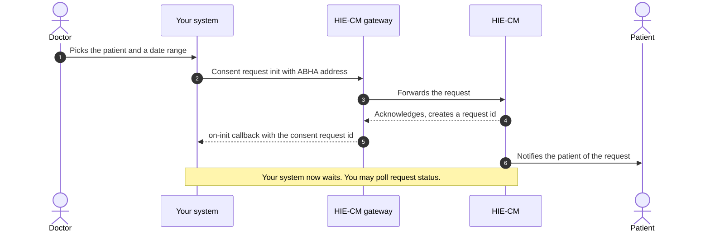
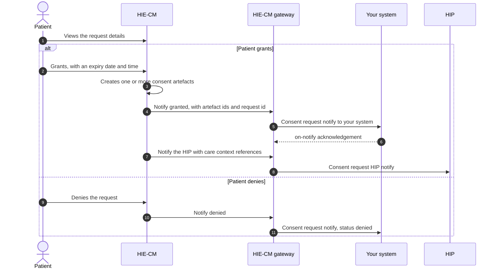
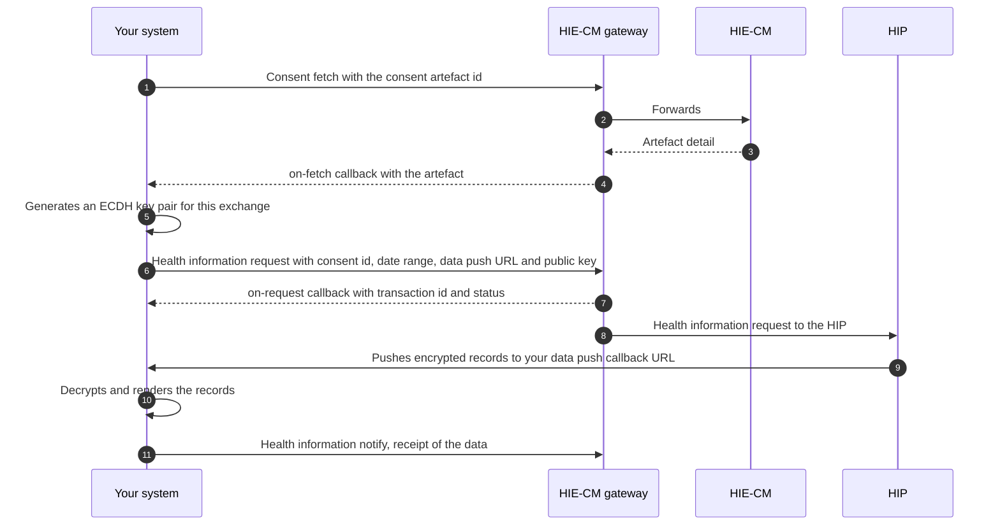

# M3 Retrieve: Health Information User Services

Milestone 3 enables a participating entity, acting as a [Health Information User](/docs/hiecm/v3/getting-started/glossary#hiu) (HIU), to request and retrieve a patient's health information through the ABDM consent-management framework. The HIU initiates a consent request with the prescribed parameters. Upon the patient's approval, the [HIE-CM](/docs/hiecm/v3/getting-started/glossary#hie-cm) provides the applicable [consent artefact](/docs/hiecm/v3/getting-started/glossary#consent-artefact) details. These enable the HIU to request and retrieve authorised health information from the concerned Health Information Provider(s).

[Try the M3 APIs](/docs/hiecm/v3/api/m3)

[Every call in M3, one page each: the headers it needs, the payload it takes, the callback it triggers, and a request builder you can fire at the sandbox.](/docs/hiecm/v3/api/m3)

[Error codes](/docs/hiecm/v3/api/m3/errors)

[What each code M3 returns actually means, and the first thing to check when you see one.](/docs/hiecm/v3/api/m3/errors)

## In short

The HIU initiates a consent request using the patient's [ABHA Address](/docs/hiecm/v3/getting-started/glossary#abha-address). The HIE-CM notifies the patient and communicates the consent status through the ABDM Gateway. Upon approval, the HIU fetches the generated consent artefact(s) and requests the authorised health information. The concerned [HIP](/docs/hiecm/v3/getting-started/glossary#hip) encrypts and transfers the information to the HIU's specified data-push URL, following which the HIU submits the prescribed receipt-status notification.

## Capabilities under M3

| Capability                 | What it enables                                                                                                                |
| -------------------------- | ------------------------------------------------------------------------------------------------------------------------------ |
| Consent request            | Initiate a consent request using the patient's ABHA Address, specified health-information types and defined date range.        |
| Status tracking            | Track the consent status as Granted, Revoked, Expired or Denied.                                                               |
| Consent artefacts          | Receive and fetch all consent artefacts generated upon approval.                                                               |
| Health information request | Request health information under a valid consent artefact.                                                                     |
| Data receipt               | Receive and decrypt the information through the specified data-push URL and submit the prescribed receipt-status notification. |

Milestone 3 does not cover ABHA creation under Milestone 1 or health-record linking and sharing by a Health Information Provider under Milestone 2. An entity performing both HIP and HIU roles shall implement the applicable [Milestone 2](/docs/hiecm/v3/milestones/m2) and Milestone 3 workflows.

## Who needs it

Milestone 3 applies to entities or applications performing the Health Information User (HIU) role and requiring access to health information held by one or more Health Information Providers. These may include healthcare facilities, insurers, referral-service providers, clinical decision-support applications and [PHR](/docs/hiecm/v3/getting-started/glossary#phr) applications acting on behalf of the patient.

## Prerequisites

Before implementing Milestone 3, the entity shall complete the applicable [Milestone 1](/docs/hiecm/v3/milestones/m1) requirements, register and configure itself as a Health Information User (HIU), maintain an accessible data-push URL, and implement the prescribed security mechanism for receiving and decrypting authorised health information. The HIU shall identify the patient using the applicable ABDM identifier. It shall implement the prescribed consent, artefact-fetch, health-information request and receipt-status workflows.

## What you build, in order

1. Initiate the consent request and receive its identifier through the prescribed callback.
2. Track the consent status as Granted, Revoked, Expired or Denied.
3. Fetch all consent artefacts generated against the approved request.
4. Initiate the health-information request against the relevant valid consent artefact.
5. Receive and decrypt the information through the specified data-push URL and submit the prescribed receipt-status notification.
6. Discontinue access upon consent expiry or revocation.

## Build M3 with an AI coding assistant

The M3 skill gives an AI coding assistant this milestone as one file: every M3 call and callback with its error codes. Install it, or open it in your assistant in one click.

M3 agent skill

Every M3 call and callback with its error codes in one file: 25 operations, 95 codes.

[SKILL.md](/skills/abdm-m3/SKILL.md "The router. Use the command below to take the references with it.")

- ScaffoldThe loop that builds the module flow by flow against the sandbox, ending on an observed result rather than on a call returning 200.
- Integrate23 operations, with their hosts, headers and the rules that hold across them.
- DebugNo error code is recorded for this module yet.

`mkdir -p .claude/skills/abdm-m3/references && curl -fsSL https://abdm-docs.dev.eka.care/skills/abdm-m3/SKILL.md -o .claude/skills/abdm-m3/SKILL.md && for f in scaffold integrate debug; do curl -fsSL https://abdm-docs.dev.eka.care/skills/abdm-m3/references/$f.md -o .claude/skills/abdm-m3/references/$f.md; done`

[Open in Claude](claude://code/new?q=Install%20the%20ABDM%20M3%20agent%20skill%20into%20this%20project%2C%20then%20help%20me%20use%20it.%0A%0ARun%20this%3A%0Amkdir%20-p%20.claude%2Fskills%2Fabdm-m3%2Freferences%20%26%26%20curl%20-fsSL%20https%3A%2F%2Fabdm-docs.dev.eka.care%2Fskills%2Fabdm-m3%2FSKILL.md%20-o%20.claude%2Fskills%2Fabdm-m3%2FSKILL.md%20%26%26%20for%20f%20in%20scaffold%20integrate%20debug%3B%20do%20curl%20-fsSL%20https%3A%2F%2Fabdm-docs.dev.eka.care%2Fskills%2Fabdm-m3%2Freferences%2F%24f.md%20-o%20.claude%2Fskills%2Fabdm-m3%2Freferences%2F%24f.md%3B%20done%0A%0AIf%20this%20session%20did%20not%20open%20in%20the%20repository%20I%20am%20integrating%20ABDM%20into%2C%20ask%20me%20for%20the%20path%20before%20you%20write%20anything.)

Drops the skill into this project. Claude loads it when a task matches.

How to use it

1. Run the command above in the repository you are integrating.
2. Ask your agent for the job in your own words. "Raise a consent request and fetch the records it covers". The skill loads when the task matches it.
3. Check what it writes against these pages. The skill carries the facts, not the sandbox: nothing in it has been run against ABDM.
4. Open in Claude needs that app installed. It fills the composer and waits: nothing runs until you read it and press Enter.

## Workflow overview

Milestone 3 covers the consent-management and health-information exchange workflow of a Health Information User (HIU). The HIU initiates a consent request for specified health information. Upon the patient's approval, the HIU fetches the applicable consent artefact and initiates the health-information request. The following diagrams illustrate this workflow and shall be read with the applicable [M3 API specifications](/docs/hiecm/v3/api/m3).

| In the diagram | Description                                                                                                                 |
| -------------- | --------------------------------------------------------------------------------------------------------------------------- |
| Patient        | The individual whose health records are requested, acting through the PHR application.                                      |
| Your system    | The organisation's software application through which the request is initiated.                                             |
| HIE-CM Gateway | The ABDM [gateway](/docs/hiecm/v3/getting-started/glossary#gateway) responsible for routing all API requests and callbacks. |
| HIE-CM         | The consent manager responsible for managing consent and notifying the patient.                                             |
| HIP            | The healthcare facility holding the records and acting as the Health Information Provider.                                  |

## Journey 1: raising a consent request

- An HIU requests access to a patient's health data by sending a consent request with the patient's ABHA address via the HIE-CM.
- The HIE-CM acknowledges the request and returns a Consent Request ID through the Gateway.
- The patient is notified by the HIE-CM and can review, approve, or deny the consent request.
- The HIE-CM then communicates the patient's consent status back to the HIU through the Gateway.

The consent request ID is the handle for everything that follows. Store it against the requester and the patient.

## Journey 2: the patient grants or denies

- If the request is approved, the HIE-CM shares the consent artefact IDs generated for that request with the HIU.
- If the request is denied, the HIE-CM notifies the HIU that the consent request has been rejected.

* A grant carries an expiry. The patient sets when the permission runs out.
* A grant can produce more than one consent artefact. Store every id the grant returns.
* The patient can revoke a granted consent. Discontinue access when it is revoked or expires.

## Journey 3: fetching the records

With an artefact id you fetch the artefact, then ask for the data it covers. The data lands on the data push URL you supplied in that request.

Decrypt the data, then present it in a readable format. The key exchange is [ECDH](/docs/hiecm/v3/getting-started/glossary#ecdh), the same scheme the HIP uses in [M2](/docs/hiecm/v3/milestones/m2).

## Next

- The calls, callbacks and error codes: [M3 API reference](/docs/hiecm/v3/api/m3).
- The cases M3 is tested against: the certification pack NHA issues. Certification runs once, for the whole integration: [Go live](/docs/hiecm/v3/getting-started/going-live).
- The next milestone: [M4 Enrol](/docs/hiecm/v3/milestones/m4).
