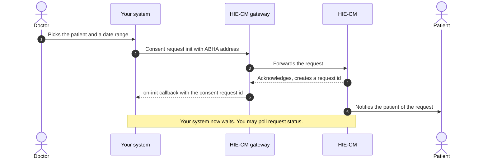
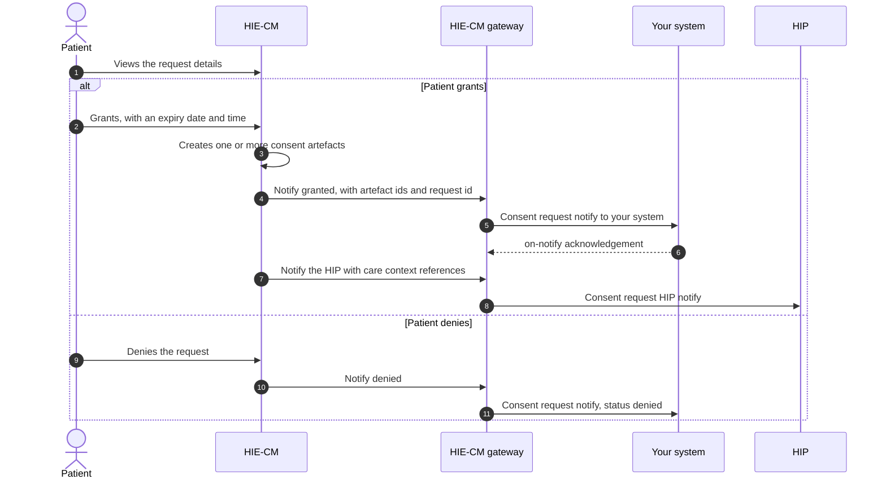
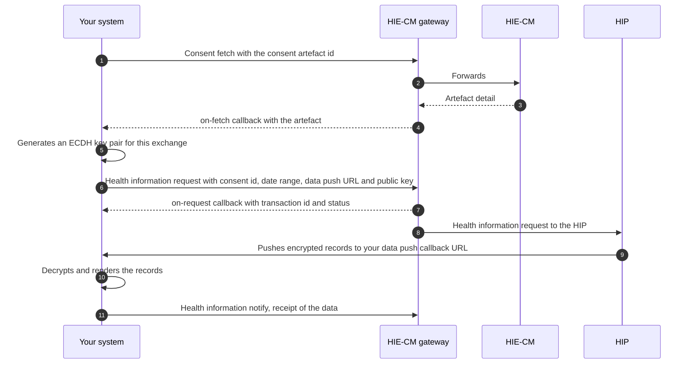

# M3 Retrieve: consent and fetching

In Milestone 3 your organisation asks a patient for permission to read health records it did not create, then fetches them. Your organisation is the [HIU](/docs/hiecm/v3/getting-started/glossary#hiu), and your software is how it asks. The [HIE-CM](/docs/hiecm/v3/getting-started/glossary#hie-cm) holds the consent, asks the patient on your behalf, and on a grant returns a [consent artefact](/docs/hiecm/v3/getting-started/glossary#consent-artefact) id. No artefact, no records.

[Try the M3 APIs](/docs/hiecm/v3/api/m3)

[Every call in M3, one page each: the headers it needs, the payload it takes, the callback it triggers, and a request builder you can fire at the sandbox.](/docs/hiecm/v3/api/m3)

[Error codes](/docs/hiecm/v3/api/m3/errors)

[What each code M3 returns actually means, and the first thing to check when you see one.](/docs/hiecm/v3/api/m3/errors)

## In short

- The HIE-CM asks the patient. You never ask the patient directly.
- The patient must already be known to you by [ABHA address](/docs/hiecm/v3/getting-started/glossary#abha-address).
- One request can produce more than one artefact. Store the request id and every artefact id.
- Records arrive encrypted on your callback URL. Decrypt them, then acknowledge to the gateway.
- `consentId` and `consentRequestId` are declared as UUIDs but the published examples are not. Do not validate them as UUIDs.

## What M3 gives you

| Capability                 | What your system can do                                                            |
| -------------------------- | ---------------------------------------------------------------------------------- |
| Consent request            | Ask a patient, by ABHA address, for named record types over a named date range     |
| Status tracking            | Check whether a request is pending, granted or denied                              |
| Consent artefacts          | Receive the artefact ids created on a grant, and fetch each artefact               |
| Health information request | Ask for the records an artefact covers                                             |
| Data receipt               | Receive encrypted records on your callback URL, decrypt them, and acknowledge them |

M3 creates no identities, which is [M1 Create](/docs/hiecm/v3/milestones/m1), and publishes no records, which is [M2 Attach](/docs/hiecm/v3/milestones/m2). A hospital that shares its own records and reads records held elsewhere builds both.

## Who needs it

Whoever asks to read records they did not create. A hospital pulling a patient's history, an insurer settling a claim, a referral service, a clinical decision tool, and a citizen whose [PHR](/docs/hiecm/v3/getting-started/glossary#phr) app fetches their records.

## Prerequisites

1. A working [M1 Create](/docs/hiecm/v3/milestones/m1) integration, so you hold a session token and an ABHA address for the patient.
2. Registration in the HIU role, from [M4 Enrol](/docs/hiecm/v3/milestones/m4). A facility registers an HIU bridge against its facility ID. The [HFR](/docs/hiecm/v3/getting-started/glossary#hfr) does not list insurers, so confirm which entry your organisation registers against. M4 blocks production, not your sandbox build.
3. A callback URL the gateway can reach, and a key pair for decryption.

The patient must be known to you by ABHA address first. One concrete route: the patient scans the health facility QR code at registration, and a doctor raises a consent request against that address.

Identifier format

Do not validate `consentId` or `consentRequestId` as UUIDs. Treat both as opaque strings.

## What you build, in order

1. **Raise a consent request.** You get a request id on a callback, not inline.
2. **Track its status.** Pending, granted or denied.
3. **Collect the artefacts.** A grant produces one or more artefact ids. Fetch each artefact.
4. **Raise a health information request** against an artefact.
5. **Receive, decrypt and acknowledge** the records on your callback URL.

Build for revocation from the start. A consent that worked yesterday can be withdrawn today, and that is the system working correctly.

## Build it with an agent

Hand M3 to the agent you already use, as one file it loads once. Install it, or open it there in one click.

M3 agent skill

Every M3 call and callback with its error codes in one file: 25 operations, 95 codes.

[SKILL.md](/skills/abdm-m3/SKILL.md "The router. Use the command below to take the references with it.")

- ScaffoldThe loop that builds the module flow by flow against the sandbox, ending on an observed result rather than on a call returning 200.
- Integrate25 operations, with their hosts, headers and the rules that hold across them.
- Debug95 recorded error codes, each with its message and what to do about it.
- Test32 test cases, each with the call it makes and what to see when it passes.

`mkdir -p .claude/skills/abdm-m3/references && curl -fsSL https://abdm-docs.dev.eka.care/skills/abdm-m3/SKILL.md -o .claude/skills/abdm-m3/SKILL.md && for f in scaffold integrate debug test; do curl -fsSL https://abdm-docs.dev.eka.care/skills/abdm-m3/references/$f.md -o .claude/skills/abdm-m3/references/$f.md; done`

[Open in Claude](claude://code/new?q=Install%20the%20ABDM%20M3%20agent%20skill%20into%20this%20project%2C%20then%20help%20me%20use%20it.%0A%0ARun%20this%3A%0Amkdir%20-p%20.claude%2Fskills%2Fabdm-m3%2Freferences%20%26%26%20curl%20-fsSL%20https%3A%2F%2Fabdm-docs.dev.eka.care%2Fskills%2Fabdm-m3%2FSKILL.md%20-o%20.claude%2Fskills%2Fabdm-m3%2FSKILL.md%20%26%26%20for%20f%20in%20scaffold%20integrate%20debug%20test%3B%20do%20curl%20-fsSL%20https%3A%2F%2Fabdm-docs.dev.eka.care%2Fskills%2Fabdm-m3%2Freferences%2F%24f.md%20-o%20.claude%2Fskills%2Fabdm-m3%2Freferences%2F%24f.md%3B%20done%0A%0AIf%20this%20session%20did%20not%20open%20in%20the%20repository%20I%20am%20integrating%20ABDM%20into%2C%20ask%20me%20for%20the%20path%20before%20you%20write%20anything.)

Drops the skill into this project. Claude loads it when a task matches.

How to use it

1. Run the command above in the repository you are integrating.
2. Ask your agent for the job in your own words. "Raise a consent request and fetch the records it covers", "why am I getting ABDM-1000", or "write the M3 tests for this". The skill loads when the task matches it.
3. Check what it writes against these pages. The skill carries the facts, not the sandbox: nothing in it has been run against ABDM.
4. Open in Claude needs that app installed. It fills the composer and waits: nothing runs until you read it and press Enter.

## Certification

M3 has no certification step of its own. One exit process covers the whole integration, run once, after every milestone your role needs works end to end. See [Going live](/docs/hiecm/v3/getting-started/going-live) for the four steps and what each one asks of you.

Test data is in the [data dictionary](/docs/hiecm/v3/reference/data-dictionary). [Support](/docs/support) lists the channels. The cases you are certified against are in [M3 testing use cases](/docs/hiecm/v3/resources/testing/m3).

## The journey, one diagram per flow

Milestone 3 (M3) of [ABDM](/docs/hiecm/v3/getting-started/glossary#abdm) is one story in three parts: a doctor asks for a patient's past records, the patient says yes or no, and if yes the records travel. Each part is drawn below, so you can see the round trips before you read the [API reference](/reference/hiecm-m3).

| In the diagram | What it is                                                                                                                                 |
| -------------- | ------------------------------------------------------------------------------------------------------------------------------------------ |
| Patient        | The person whose records these are, acting in their [PHR](/docs/hiecm/v3/getting-started/glossary#phr) app                                 |
| Your system    | The software your organisation asks through                                                                                                |
| HIE-CM gateway | The [gateway](/docs/hiecm/v3/getting-started/glossary#gateway), which routes every call and callback                                       |
| HIE-CM         | The [HIE-CM](/docs/hiecm/v3/getting-started/glossary#hie-cm), which holds consent and asks the patient                                     |
| HIP            | The facility holding the records. It is the [HIP](/docs/hiecm/v3/getting-started/glossary#hip) when it publishes them, in journeys 2 and 3 |

## Journey 1: raising a consent request

A doctor wants the patient's earlier records for a date range. Your system sends the request with the patient's [ABHA](/docs/hiecm/v3/getting-started/glossary#abha) address. Nothing comes back inline: you get a request id on a callback, then wait for the patient.

The request id is the handle for everything that follows. Store it against the doctor and the patient.

## Journey 2: the patient grants or denies

The patient sees who is asking, what they want, why, and for how long. The HIE-CM tells both sides what they chose.

- A grant carries an expiry. The patient sets when the permission runs out.
- A grant can produce more than one consent artefact. Store every id the grant returns.
- The patient can revoke a granted consent at any time. Your access ends when they do.

## Journey 3: fetching the records

With an artefact id you fetch the artefact, then ask for the data it covers. The data lands on the data push URL you supplied in that request.

The records arrive encrypted, at the data push URL you supplied. Whether that URL must differ from your other registered callback URLs is not yet published. Your side is simple: decrypt the data, then present it in a readable format.

The scheme is [ECDH](/docs/hiecm/v3/getting-started/glossary#ecdh) key exchange, specified on the [HIP](/docs/hiecm/v3/getting-started/glossary#hip) side. See [M2](/docs/hiecm/v3/api/m2).

## What the patient sees

The patient's screens and expiry screens are not reproduced here. What applies to you is on the [use cases](/reference/hiecm-m3) page under patient rights.

## Next

- The request, the decision and the fetch as diagrams: [M3 journey below](#the-journey-one-diagram-per-flow).
- The calls, callbacks and error codes: [M3 API reference](/docs/hiecm/v3/api/m3).
- The next milestone: [M4 Enrol](/docs/hiecm/v3/milestones/m4).
