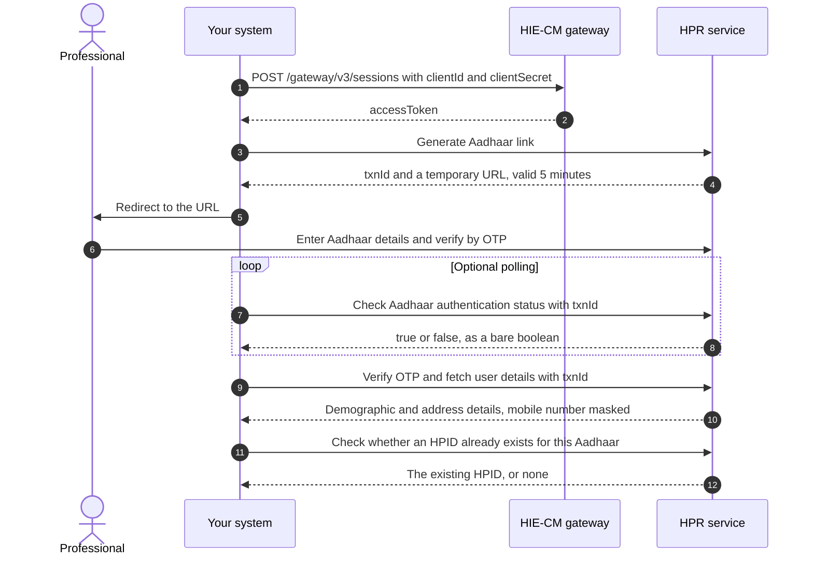
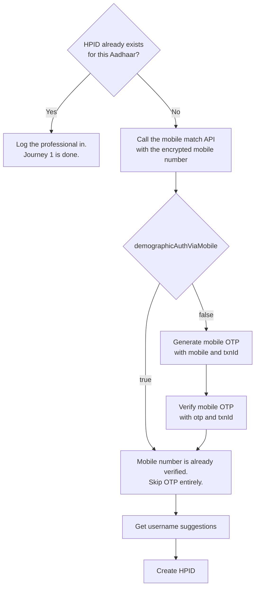
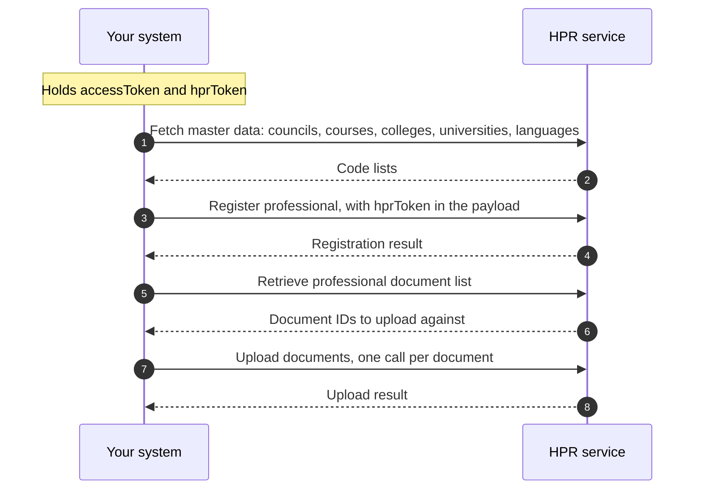
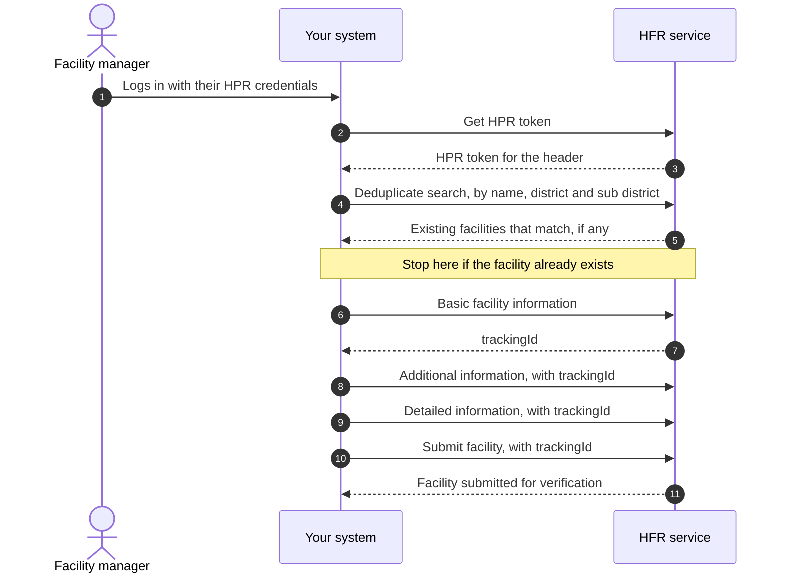
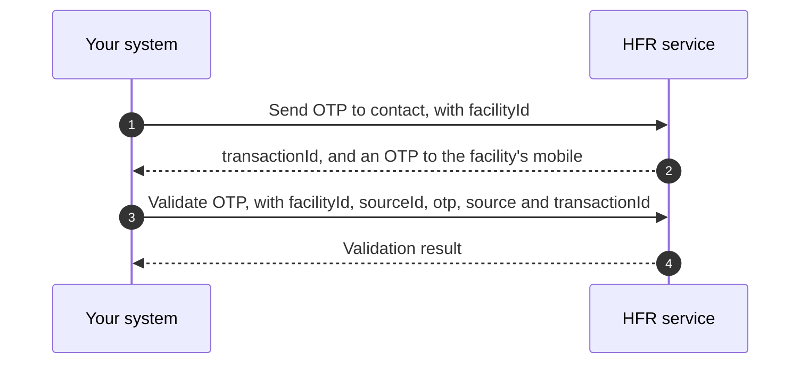
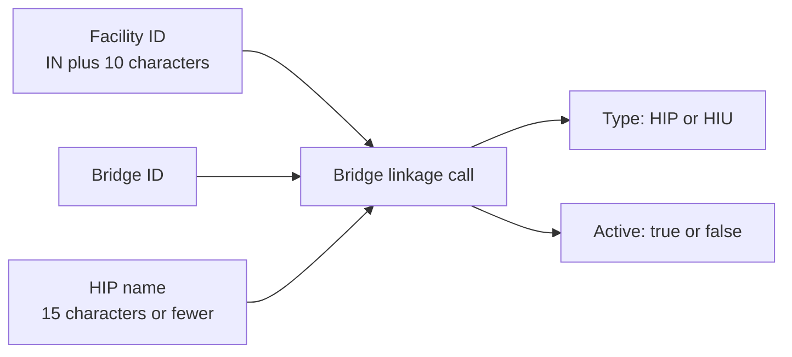

# M4 Enrol: Register Healthcare Professionals and Facilities

Milestone 4 is the Registries milestone, commonly referred to as NHPR, the National Healthcare Professionals and Facilities Registry. It establishes the identity of healthcare professionals and the details of healthcare facilities within the ABDM ecosystem.

Neither the [HPR](/docs/hiecm/v3/getting-started/glossary#hpr) nor the [HFR](/docs/hiecm/v3/getting-started/glossary#hfr) is responsible for moving health records. These registries establish who the healthcare professional is and what the healthcare facility is, providing a verified identity and facility layer for subsequent ABDM transactions.

[Try the M4 APIs](/docs/hiecm/v3/api/m4)

[Every call in M4, one page each: the headers it needs, the payload it takes, the callback it triggers, and a request builder you can fire at the sandbox.](/docs/hiecm/v3/api/m4)

## In short

- The Healthcare Professionals Registry (HPR) is a comprehensive repository of registered and verified healthcare professionals. It includes doctors from Modern Medicine, Dentistry, Ayurveda, Unani, Siddha, Sowa-Rigpa and Homeopathy, as well as nurses and pharmacists delivering healthcare services across India. A healthcare professional registers on the HPR and is issued a unique [HPID](/docs/hiecm/v3/getting-started/glossary#hpid), which is 14 digits.
- The Health Facility Registry (HFR) is a comprehensive repository of health facilities across the country, covering both modern and traditional systems of medicine. It includes public and private facilities such as hospitals, clinics, diagnostic laboratories, imaging centres and pharmacies. A facility is onboarded to the HFR and is issued a unique Facility ID, 12 characters in the form `IN` plus 10 characters.
- M2 and M3 need a Facility ID in production. M4 is the API route to one. The NHPR portal is the other, and a product that registers its facilities there by hand never builds M4.

Not a step by step guide

These pages cover the shape of M4 and the endpoints that are named. They are not yet a step by step guide to building it.

## M4 scope and capabilities

| Capability             | Key output                                                                                                                                                                          | Target user                                                                                             |
| ---------------------- | ----------------------------------------------------------------------------------------------------------------------------------------------------------------------------------- | ------------------------------------------------------------------------------------------------------- |
| HPID creation          | A 14 digit HPID, issued after Aadhaar authentication                                                                                                                                | Doctors, nurses, pharmacists, and facility managers                                                     |
| Register professional  | A complete HPR profile, including qualifications, council registration, and current work details                                                                                    | Healthcare professionals after HPID creation                                                            |
| Facility onboarding    | A 12 character unique Facility ID for registration in the HFR                                                                                                                       | Hospitals, clinics, laboratories, imaging centres, pharmacies, blood banks, and other health facilities |
| Bridge linkage         | A link between a Facility ID and one or more bridges, each identified as a [HIP](/docs/hiecm/v3/getting-started/glossary#hip) or [HIU](/docs/hiecm/v3/getting-started/glossary#hiu) | A facility whose software is going live                                                                 |
| Search and master data | Facility search and nearby search                                                                                                                                                   | Anyone building either of the above                                                                     |

## Intended users

- **Facilities going live.** A facility must be registered in the HFR and have a bridge linked to it to share health information as a HIP or retrieve it as an HIU. For facilities that have implemented [M2 Attach](/docs/hiecm/v3/milestones/m2) or [M3 Retrieve](/docs/hiecm/v3/milestones/m3), M4 is the next step towards production readiness.
- **Professionals registering.** An HPR ID provides a verified professional identity within ABDM. Currently, registration is available for three categories: doctors, nurses and pharmacists.
- **Software acting for others.** An [HMIS](/docs/hiecm/v3/getting-started/glossary#hmis) or practice management product can drive these calls for its own customers.

## How HPR and HFR work together

HPR and HFR represent two connected parts of the healthcare ecosystem. HPR enables healthcare professionals to register and maintain their professional identity and profile, while HFR enables hospitals, clinics, laboratories, pharmacies, and other healthcare facilities to register and maintain their facility information.

Once a facility is registered in the HFR, healthcare professionals can link their professional profile to that facility as their place of work. Similarly, an HPR-registered professional can declare the HFR facility where they currently work. This creates a connection between who provides healthcare and where healthcare is provided, allowing professionals and facilities to be linked within the ABDM ecosystem.

## Build it with an agent

Hand M4 to the agent you already use, as one file it loads once. Install it, or open it there in one click.

M4 agent skill

Every M4 call in one file: 100 operations.

[SKILL.md](/skills/abdm-m4/SKILL.md "The router. Use the command below to take the references with it.")

- ScaffoldThe loop that builds the module flow by flow against the sandbox, ending on an observed result rather than on a call returning 200.
- Integrate111 operations, with their hosts, headers and the rules that hold across them.
- DebugNo error code is recorded for this module yet.

`mkdir -p .claude/skills/abdm-m4/references && curl -fsSL https://abdm-docs.dev.eka.care/skills/abdm-m4/SKILL.md -o .claude/skills/abdm-m4/SKILL.md && for f in scaffold integrate debug; do curl -fsSL https://abdm-docs.dev.eka.care/skills/abdm-m4/references/$f.md -o .claude/skills/abdm-m4/references/$f.md; done`

[Open in Claude](claude://code/new?q=Install%20the%20ABDM%20M4%20agent%20skill%20into%20this%20project%2C%20then%20help%20me%20use%20it.%0A%0ARun%20this%3A%0Amkdir%20-p%20.claude%2Fskills%2Fabdm-m4%2Freferences%20%26%26%20curl%20-fsSL%20https%3A%2F%2Fabdm-docs.dev.eka.care%2Fskills%2Fabdm-m4%2FSKILL.md%20-o%20.claude%2Fskills%2Fabdm-m4%2FSKILL.md%20%26%26%20for%20f%20in%20scaffold%20integrate%20debug%3B%20do%20curl%20-fsSL%20https%3A%2F%2Fabdm-docs.dev.eka.care%2Fskills%2Fabdm-m4%2Freferences%2F%24f.md%20-o%20.claude%2Fskills%2Fabdm-m4%2Freferences%2F%24f.md%3B%20done%0A%0AIf%20this%20session%20did%20not%20open%20in%20the%20repository%20I%20am%20integrating%20ABDM%20into%2C%20ask%20me%20for%20the%20path%20before%20you%20write%20anything.)

Drops the skill into this project. Claude loads it when a task matches.

How to use it

1. Run the command above in the repository you are integrating.
2. Ask your agent for the job in your own words. "Onboard this facility to the HFR and link its HIP bridge". The skill loads when the task matches it.
3. Check what it writes against these pages. The skill carries the facts, not the sandbox: nothing in it has been run against ABDM.
4. Open in Claude needs that app installed. It fills the composer and waits: nothing runs until you read it and press Enter.

## Certification

M4 does not have a separate certification process. A single exit process covers the complete integration and is conducted once all the required milestones for your role are working end to end.

[Going live](/docs/hiecm/v3/getting-started/going-live) outlines the four steps involved and the requirements for each step.

## The journey, step by step

Milestone 4 of [ABDM](/docs/hiecm/v3/getting-started/glossary#abdm) covers the following key journeys.

- **HPID creation and role selection.** A healthcare professional completes Aadhaar authentication and creates an [HPID](/docs/hiecm/v3/getting-started/glossary#hpid). The professional then selects the required role: [HPR](/docs/hiecm/v3/getting-started/glossary#hpr), [HFR](/docs/hiecm/v3/getting-started/glossary#hfr), or both.
- **HPR registration.** If HPR is selected, the professional completes the required personal, qualification, registration and work details.
- **HFR registration.** If HFR is selected, the professional completes the Health Facility Registry registration form with the required facility details.
- **Facility software integration.** A registered facility can link its bridge to the Facility ID, enabling it to publish health records as the [HIP](/docs/hiecm/v3/getting-started/glossary#hip) and retrieve records as the [HIU](/docs/hiecm/v3/getting-started/glossary#hiu) through its software.

| Role selected | The sequence                                                                                                                                                 |
| ------------- | ------------------------------------------------------------------------------------------------------------------------------------------------------------ |
| HPR           | Aadhaar authentication, role selection, HPID creation, HPR registration                                                                                      |
| HFR           | Aadhaar authentication, role selection, HPID creation, HFR registration, then facility software integration as HIP or HIU where applicable                   |
| Both          | Aadhaar authentication, role selection, HPID creation, HFR registration, HPR registration, then facility software integration as HIP or HIU where applicable |

This page shows the order of calls in each. Field lists are in the [M4 API reference](/docs/hiecm/v3/api/m4).

A map, not a runbook

These diagrams follow the published order of steps.

## Journey 1: creating an HPID for a professional

### Aadhaar authentication

The professional authenticates using Aadhaar. The integrating system does not handle the Aadhaar number or [OTP](/docs/hiecm/v3/getting-started/glossary#otp). Instead, it handles the transaction ID and redirects the user to the URL returned by the HPR service.

The URL is valid for five minutes. If it expires before authentication is completed, call Generate Aadhaar Link again to obtain a new authentication URL. After authentication the professional selects the role to register for: HPR, HFR, or both.

### Login using a mobile number and OTP, or credentials

If an HPID already exists, the professional is already registered. Authenticate the professional and proceed directly to login, skipping the HPID creation journey.

A returning professional can also log in without Aadhaar authentication, using either a mobile OTP or a password. Both are under [HPR authentication](/docs/hiecm/v3/api/m4/endpoints/m4-authentication/01-m4-post-v1-auth-authpassword) in the M4 API reference.

If no HPID exists, the mobile number must be verified before creating the HPID:

1. Fetch the public certificate from `/v4/int/api/v1/auth/cert`.
2. Encrypt the mobile number using `RSA/ECB/PKCS1Padding`.
3. Send the encrypted value in the API request.

Create HPID returns a `token`. The register professional call carries an `hprToken` in its payload.

## Journey 2: registering a professional on the HPR

The HPID is an identity, not a professional profile. The professional profile is created through the registration process, which captures details such as qualifications, council registration, and current work information. Professional registration requires the HPR token returned from journey 1.

The following documents are mandatory for upload: the qualification degree certificate, and the registration certificate. A proof of work certificate is mandatory for professionals working in government, or in both government and private settings.

The registration API requires codes rather than names, so fetch the relevant master data through the master APIs first and use those codes during registration. Master data includes council, course, college, university, state, district and language.

## Journey 3: onboarding a facility to the HFR

Onboarding consists of one search, three updates, and a final submission, with each update adding another layer of facility details. If you stop before submission, the facility remains in Draft status and is not visible on ABDM.

The first update captures the basic facility information and creates the Facility ID. The Facility ID is retained throughout the onboarding flow, but remains masked until the facility is fully submitted. Once submission is complete, the Facility ID becomes visible. The API returns it as `trackingId`, and that is the value every later update carries.

### What each update carries

| Call                       | Information captured                                                                                                                                                                                   |
| -------------------------- | ------------------------------------------------------------------------------------------------------------------------------------------------------------------------------------------------------ |
| Basic facility information | Facility name, ownership, system of medicine, facility type and subtype, address with LGD codes, contact details, board and building photographs, and opening hours                                    |
| Additional information     | Availability of services and units such as a pharmacy, blood bank, dialysis centre, cath lab, diagnostic laboratory, or imaging centre, plus scheme identifiers such as ABPMJAY, Rohini, ECHS and CGHS |
| Detailed information       | Specialities by system of medicine, bed and ventilator counts, and applicable sections for pharmacy, blood bank, diagnostic laboratory and imaging                                                     |
| Submit facility            | The tracking ID and an optional source of information. Moves the facility application out of Draft status                                                                                              |

The mandatory fields under detailed information vary based on the facility type, service type, and system of medicine selected during registration. Diagnostic laboratories, imaging centres, blood banks and pharmacies do not require medical infrastructure counts, such as bed or ventilator counts.

### OTP based facility verification

A shorter verification flow is available for government programmes. An OTP is sent to the contact number registered against the Facility ID, which is then validated to complete verification.

## Journey 4: linking bridges to a facility

A Facility ID alone does not enable health record exchange. The facility must be linked to a bridge, with each linkage designated as either a HIP or an HIU.

- A single facility can be linked to multiple bridges.
- A single bridge can be linked to multiple facilities. See [one bridge, many facilities](/docs/hiecm/v3/concepts/how-it-fits#one-bridge-many-facilities).
- The HIP or HIU role is defined for each facility and bridge linkage.
- Integration-level configurations are set once, while facility-specific configurations are maintained separately for each linked facility.

The HIP name is the name displayed to patients in their [ABHA](/docs/hiecm/v3/getting-started/glossary#abha) or [PHR](/docs/hiecm/v3/getting-started/glossary#phr) app when they search for a hospital. Three rules apply: a maximum of 15 characters, no special characters, and it must be unique for every bridge linked to the same facility. For example, the HIP name can be derived by combining the hospital name and the bridge name, while keeping to those rules.

A facility with a Facility ID and a linked HIP bridge can perform [M2](/docs/hiecm/v3/api/m2) activities, including linking care contexts and sharing health records. A facility with a linked HIU bridge can perform [M3](/docs/hiecm/v3/api/m3) activities, including requesting patient consent and fetching health records. M4 covers the registration of the facility and the healthcare professionals working at the facility.

Next: [M4 API reference](/docs/hiecm/v3/api/m4).

## Next

- The base URLs and the operation list: [M4 API reference](/docs/hiecm/v3/api/m4).
- The patient side of all four: [P1 Identity and profile](/docs/hiecm/v3/milestones/p1).
- Take your integration to production: [Go live](/docs/hiecm/v3/getting-started/going-live).
