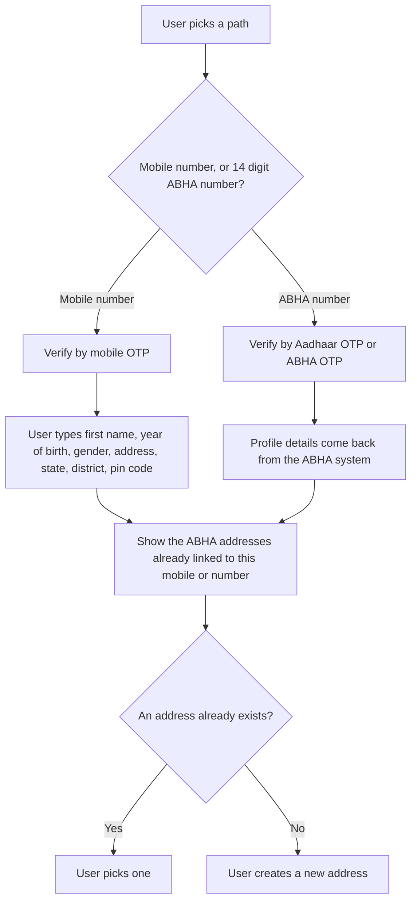

# P1 Identity and profile

P1 is the patient side of [M1 Create](/docs/hiecm/v3/milestones/m1). M1 is how a hospital system creates an [ABHA](/docs/hiecm/v3/getting-started/glossary#abha). P1 is how the patient's own [PHR](/docs/hiecm/v3/getting-started/glossary#phr) app does it, and how it maintains the account afterwards.

[Try the P1 APIs](/docs/hiecm/v3/api/p1/endpoints/p1-certificate-and-session/01-p1-get-v3-phr-app-login-public-certificate)

[Every call in P1, one page each: the headers it needs, the payload it takes, the callback it triggers, and a request builder you can fire at the sandbox.](/docs/hiecm/v3/api/p1/endpoints/p1-certificate-and-session/01-p1-get-v3-phr-app-login-public-certificate)

[Error codes](/docs/hiecm/v3/api/p1/errors)

[What each code P1 returns actually means, and the first thing to check when you see one.](/docs/hiecm/v3/api/p1/errors)

## In short

- Every user needs an ABHA address, `username@abdm`. Consent, notifications and record sharing all hang off it.
- Build both creation paths: by mobile number, and by an existing 14 digit ABHA number.
- All eight login routes are mandatory.
- A user can hold several ABHA addresses but only one ABHA number.

## What you build

Registration and login, and the profile the patient reads and edits.

## Creating an ABHA address

A person does not need an [ABHA number](/docs/hiecm/v3/getting-started/glossary#abha-number), and does not need Aadhaar, to get an ABHA address here. A mobile number and the OTP sent to it are enough. What that buys is a Self-Declared profile: an address the network can route to, with no [KYC](/docs/hiecm/v3/getting-started/glossary#kyc) behind it and no ABHA number until the person links one later.

| Path                 | Validated by                                              | Profile details             | Result                                                               |
| -------------------- | --------------------------------------------------------- | --------------------------- | -------------------------------------------------------------------- |
| Mobile number        | Mobile [OTP](/docs/hiecm/v3/getting-started/glossary#otp) | The user types them         | Self-Declared, no [KYC](/docs/hiecm/v3/getting-started/glossary#kyc) |
| 14 digit ABHA number | Aadhaar OTP or ABHA OTP                                   | Returned by the ABHA system | KYC Verified                                                         |

After validation on either path, show the ABHA addresses already linked to that mobile number or ABHA number. The user then picks one instead of creating a duplicate.

A Self-Declared profile needs a "Link ABHA number" action. The user enters the 14 digit number and validates by Aadhaar OTP or ABHA OTP. Profile details then follow the ABHA number, and the status changes to KYC Verified.

## Login

Sign a user in to a PHR application by any of these routes, all of them mandatory.

| Route                          | Validated by                                                                |
| ------------------------------ | --------------------------------------------------------------------------- |
| Mobile number                  | Mobile OTP, then the user picks which linked ABHA address to sign in as     |
| An address such as `name@abdm` | Password, mobile OTP or email OTP, by the auth methods the address supports |
| The 14 digit ABHA number       | ABHA OTP or Aadhaar OTP                                                     |

Resend OTP unlocks after 60 seconds in every flow. You also need a reset password screen behind login, secure storage of the refresh token, and more than one user profile per install with sign in and sign out.

## Profile, card and QR code

| Element                  | What it holds                                                                              |
| ------------------------ | ------------------------------------------------------------------------------------------ |
| Profile screen           | Editable demographics, marked KYC Verified or Self-Declared                                |
| ABHA number              | Visible only on a KYC Verified profile                                                     |
| ABHA address card, a PDF | Photo, full name, ABHA number, ABHA address, QR code, date of birth, gender, mobile number |
| Editable, KYC Verified   | Mobile number, with an OTP to the new number, and address                                  |
| Editable, Self-Declared  | The same, plus photo, full name, gender and date of birth                                  |

## Next

- The calls and base URLs: [P1 API reference](/reference/hiecm-p1).
- The next milestone: [P2 Linking and records](/docs/hiecm/v3/milestones/p2).
