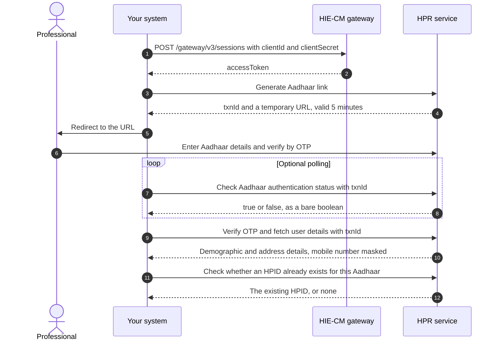
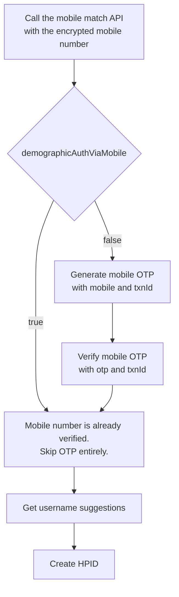
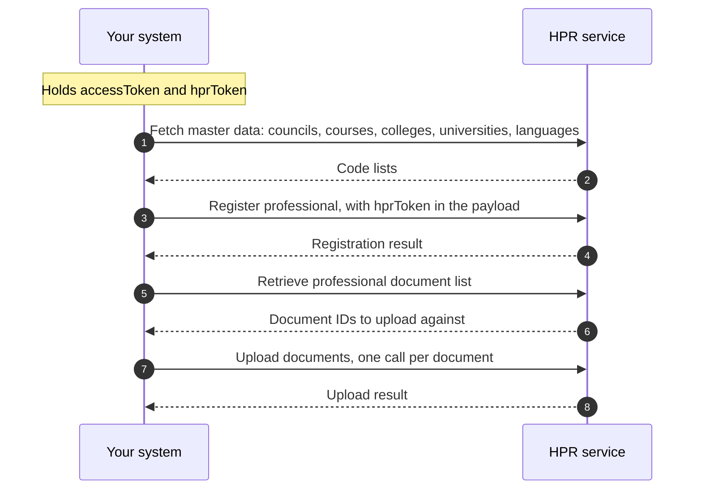
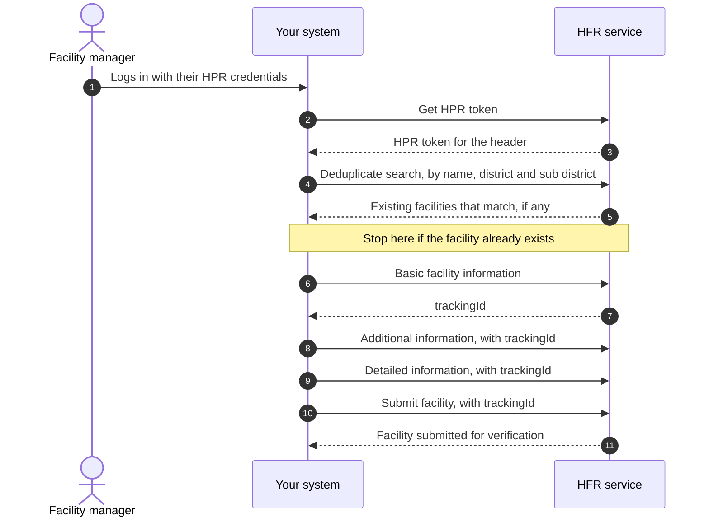
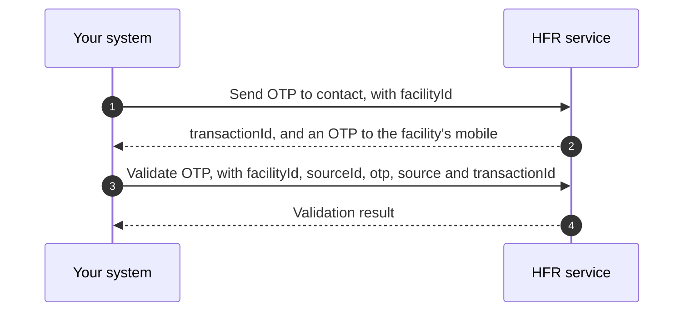
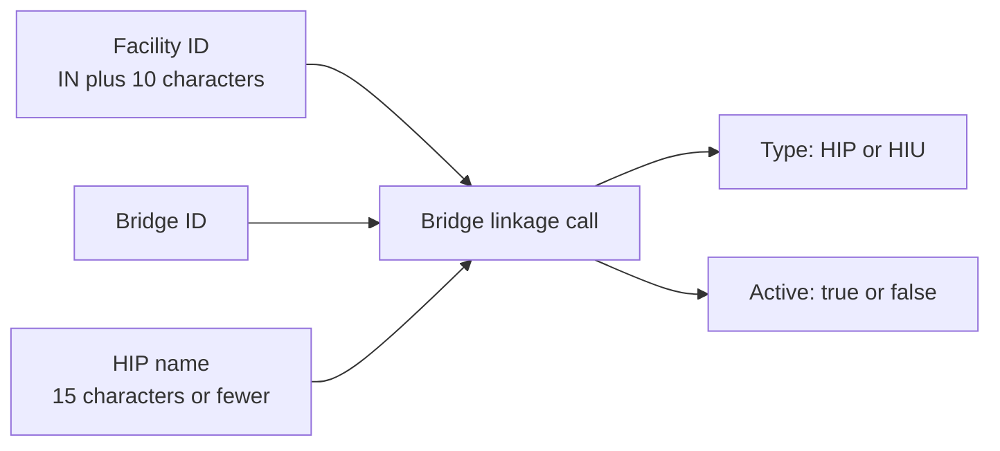

# M4 Enrol: facilities and professionals

Milestone 4 is the registries milestone, also called the NHPR. A healthcare
professional registers on the
[HPR](/docs/hiecm/v3/getting-started/glossary#hpr) and is issued an
[HPID](/docs/hiecm/v3/getting-started/glossary#hpid). A health facility onboards
to the [HFR](/docs/hiecm/v3/getting-started/glossary#hfr) and is issued a
facility ID.

Neither registry moves a health record. They establish who the professional is
and what the facility is, so every record flow has a verified provider behind
it.

## In short

- M4 certifies last but blocks M2 and M3 in production. No facility ID, no
  sharing and no fetching.
- The HPR comes first. Facility onboarding needs an HPR token, which needs a
  person with an HPID.
- A facility ID has the form `IN` plus 10 characters. An HPID is 14 digits.
- Expect to correct a host or two. Several published samples show the
  production host while describing sandbox behaviour.

:::caution[Not a step by step guide]
These pages cover the shape of M4 and the endpoints that are named. They are
not yet a step by step guide to building it.
:::

## What M4 covers

| Area | What it produces | Who it is for |
|---|---|---|
| HPID creation | A 14 digit HPID, issued after Aadhaar authentication | A doctor, nurse, pharmacist or facility manager |
| Register professional | A full HPR profile: qualifications, council registration, current work | The same professional, after the HPID exists |
| Facility onboarding | A facility ID on the HFR, in the form `IN` plus 10 characters | A hospital, clinic, lab, imaging centre, pharmacy or blood bank |
| Bridge linkage | A link between a facility ID and one or more bridges, each marked [HIP](/docs/hiecm/v3/getting-started/glossary#hip) or [HIU](/docs/hiecm/v3/getting-started/glossary#hiu) | A facility whose software is going live |
| Search and master data | Facility search, nearby search, and the code lists every other call needs | Anyone building either of the above |

## Who needs it

- **Facilities going live.** Without a facility in the HFR and a bridge linked
  to it, you cannot share as a HIP or fetch as an HIU. If you have built [M2
  Attach](./m2) or [M3 Retrieve](./m3), M4 is the step in front of production.
- **Professionals registering.** An HPID is a verified identity in ABDM. Three
  categories are open today: doctor, nurse and pharmacist. Others come later.
- **Software acting for others.** An
  [HMIS](/docs/hiecm/v3/getting-started/glossary#hmis) or practice management
  product can drive these calls for its own customers.

## How the two halves connect

The HPR comes first, twice over. Creating an HPID returns an `hprToken`, which
the register professional call carries in its payload. Onboarding a facility
needs an HPR token in the header of the create calls, generated from an HPR ID
and password. So facility onboarding usually starts with a person getting an
HPID.

## Build it with an agent

Hand M4 to the agent you already use, as one file it loads once. Install it, or open it there in one click.

## Certification

M4 has no certification step of its own. One exit process covers the whole
integration, run once, after every milestone your role needs works end to end.
See [Going live](/docs/hiecm/v3/getting-started/going-live) for the four steps
and what each one asks of you. The cases you are certified against are in [M4
testing use cases](/docs/hiecm/v3/resources/testing/m4).

## The journey, one diagram per flow

Milestone 4 of [ABDM](/docs/hiecm/v3/getting-started/glossary#abdm) has three journeys:

- A professional gets an [HPID](/docs/hiecm/v3/getting-started/glossary#hpid) and an [HPR](/docs/hiecm/v3/getting-started/glossary#hpr) profile.
- A facility manager onboards a facility to the [HFR](/docs/hiecm/v3/getting-started/glossary#hfr).
- A facility links its bridges, so it can publish records as the [HIP](/docs/hiecm/v3/getting-started/glossary#hip) and fetch them as the [HIU](/docs/hiecm/v3/getting-started/glossary#hiu) through its software.

This page shows the order of calls in each. Field lists are on the [operations and fields](/docs/hiecm/v3/api/m4/undocumented) page.

:::caution[A map, not a runbook]
These diagrams follow the published order of steps.
:::

## Journey 1: a professional gets an HPID

The professional authenticates against Aadhaar on a hosted page. Your system never handles the Aadhaar number or [OTP](/docs/hiecm/v3/getting-started/glossary#otp): it handles the transaction ID and redirects to a URL the HPR service returns, valid for five minutes. After that, call generate Aadhaar link again.

### Then the mobile number

The mobile number is confirmed before the HPID is created, by a fast path or a slow one. Send it encrypted: fetch the public certificate from `/v4/int/api/v1/auth/cert`, encrypt with `RSA/ECB/PKCS1Padding`, send the encrypted value.

Create HPID returns an `hprToken`. Keep it: the register professional call needs it.

### Then the profile

The HPID is an identity, not a profile. Registering the professional adds qualifications, council registration and current work.

Two documents are mandatory, the degree certificate and the registration certificate. A proof of work certificate is mandatory too when the professional works for government, or for both government and private.

Register professional takes codes, not names. Fetch council, course, college, university, state, district and language from the master APIs first.

## Journey 2: a facility onboards to the HFR

Onboarding is one search, three writes and a submit, each write adding a layer of detail. Stop before submit and the facility stays in draft, invisible to ABDM.

The first write, basic facility information, returns a tracking ID. That is the facility's identity for the rest of the sequence, and what you pass as the facility ID on every later update.

### What each write call carries

| Call | What it captures |
|---|---|
| Basic facility information | Name, ownership, system of medicine, facility type and subtype, address with LGD codes, contact details, board and building photographs, opening hours |
| Additional information | Whether it has a pharmacy, blood bank, dialysis centre, cath lab, diagnostic lab or imaging centre, plus scheme identifiers such as ABPMJAY, Rohini, ECHS and CGHS |
| Detailed information | Specialities per system of medicine, bed and ventilator counts, and the pharmacy, blood bank, diagnostic and imaging sections that apply to this facility type |
| Submit facility | The tracking ID and an optional source of information. Moves the facility out of draft |

Which fields are mandatory in detailed information depends on the facility type, the type of service and the system of medicine. A diagnostic laboratory, imaging centre, blood bank or pharmacy sends no medical infrastructure counts at all.

### A facility can also verify by OTP

A second, shorter path serves government programmes: send an OTP to the contact number registered against a facility ID, then validate it.

## Journey 3: linking bridges to a facility

A facility ID alone does not make records flow. The facility has to be linked to a bridge, each link marked HIP or HIU. One facility can have several.

The HIP name is what a patient sees in their [ABHA](/docs/hiecm/v3/getting-started/glossary#abha) or [PHR](/docs/hiecm/v3/getting-started/glossary#phr) app when they search for this hospital. Three rules apply: 15 characters or fewer, no special characters, and unique for every bridge on a facility. The worked example builds the name from the hospital name plus the bridge name.

A facility with a facility ID and a linked HIP bridge can do the [M2](/docs/hiecm/v3/api/m2) work, linking care contexts and sharing records. With a linked HIU bridge it can do the [M3](/docs/hiecm/v3/api/m3) work, requesting consent and fetching records. M4 is the registration step in front of either flow outside sandbox.

Next: [M4 operations and fields](/docs/hiecm/v3/api/m4/undocumented).

## Next

- The registration journeys as diagrams: [the journey below](#the-journey-one-diagram-per-flow).
- The base URLs and the operation list: [M4 API
  reference](/docs/hiecm/v3/api/m4).
- Every call with its parameters and codes: [M4 operations and
  fields](/docs/hiecm/v3/api/m4/undocumented).
- The patient side of all four: [P1 Identity and profile](./p1).
- Take your integration to production: [Go live](/docs/hiecm/v3/getting-started/going-live).
